# Advanced MCP Framework Design Document

## Table of Contents
1. [Overview](#overview)
2. [Architecture](#architecture)
3. [Core Components](#core-components)
4. [End-to-End Flows](#end-to-end-flows)
5. [Implementation Details](#implementation-details)
6. [API Specifications](#api-specifications)
7. [Security & Approval Workflows](#security--approval-workflows)
8. [Provider Integration](#provider-integration)
9. [Migration Plan](#migration-plan)

## Overview

The Advanced MCP (Model Context Protocol) Framework is a provider-agnostic, secure, and scalable system for integrating tools into LLM conversations. It replaces the basic STDIO implementation with a robust framework supporting multiple transports, approval workflows, and seamless integration with various LLM providers.

### Key Features
- **Provider Agnostic**: Works with OpenAI, Anthropic, Ollama, and other providers
- **Security First**: Tool approval workflows for sensitive operations
- **Multiple Transports**: HTTP, WebSocket, STDIO support
- **Tool Discovery**: Dynamic tool loading with caching
- **Audit Trail**: Complete logging of tool executions
- **Performance**: Connection pooling and intelligent retries

## Architecture


## Core Components

### 1. MCP Client (`mcp_client.py`)

The central orchestrator for all MCP operations.

```python
class MCPClient:
    def __init__(self, config: MCPConfig):
        self.registry = ToolRegistry()
        self.approval_service = ToolApprovalService()
        self.transports: Dict[str, Transport] = {}
        self.servers: Dict[str, MCPServer] = {}
        
    async def initialize(self):
        """Initialize all configured MCP servers"""
        for server_config in self.config.servers:
            transport = self._create_transport(server_config)
            await transport.connect()
            
            # Discover tools from server
            tools = await self._discover_tools(transport)
            self.registry.register_tools(server_config.name, tools)
            
            self.servers[server_config.name] = MCPServer(
                name=server_config.name,
                transport=transport,
                tools=tools
            )
    
    async def execute_tool(
        self,
        tool_name: str,
        arguments: Dict[str, Any],
        user_context: UserContext,
        require_approval: bool = None
    ) -> ToolResult:
        """Execute a tool with optional approval workflow"""
        # 1. Find tool in registry
        tool = self.registry.get_tool(tool_name)
        if not tool:
            raise ToolNotFoundError(f"Tool {tool_name} not found")
            
        # 2. Check if approval needed
        if require_approval is None:
            require_approval = tool.requires_approval
            
        if require_approval:
            approval = await self.approval_service.request_approval(
                tool_call=ToolCall(
                    tool_name=tool_name,
                    arguments=arguments,
                    user_id=user_context.user_id,
                    conversation_id=user_context.conversation_id
                )
            )
            
            if not approval.approved:
                return ToolResult(
                    success=False,
                    error="Tool execution rejected by user"
                )
        
        # 3. Execute tool
        server = self._find_server_for_tool(tool_name)
        result = await server.transport.execute(
            "tools/call",
            {
                "name": tool_name,
                "arguments": arguments
            }
        )
        
        # 4. Log execution
        await self._log_execution(tool_name, arguments, result, user_context)
        
        return result
```

### 2. Tool Registry (`tool_registry.py`)

Manages tool discovery, caching, and access control.

```python
class ToolRegistry:
    def __init__(self, cache: Redis = None):
        self.tools: Dict[str, Tool] = {}
        self.server_tools: Dict[str, List[str]] = {}
        self.cache = cache or Redis()
        
    async def register_tools(self, server_name: str, tools: List[Tool]):
        """Register tools from an MCP server"""
        tool_names = []
        
        for tool in tools:
            # Validate tool schema
            self._validate_tool(tool)
            
            # Add server prefix to avoid conflicts
            full_name = f"{server_name}.{tool.name}"
            tool.name = full_name
            
            # Cache tool definition
            await self.cache.set(
                f"mcp:tool:{full_name}",
                tool.to_json(),
                expire=3600  # 1 hour cache
            )
            
            self.tools[full_name] = tool
            tool_names.append(full_name)
            
        self.server_tools[server_name] = tool_names
        
    def get_tools_for_llm(
        self, 
        user_role: str, 
        provider: str,
        include_restricted: bool = False
    ) -> List[Dict[str, Any]]:
        """Get tools formatted for specific LLM provider"""
        tools = []
        
        for tool in self.tools.values():
            # Check access control
            if not self._check_access(tool, user_role, include_restricted):
                continue
                
            # Format for provider
            if provider == "openai":
                tools.append(self._format_openai_tool(tool))
            elif provider == "anthropic":
                tools.append(self._format_anthropic_tool(tool))
            elif provider == "ollama":
                tools.append(self._format_ollama_tool(tool))
            else:
                tools.append(self._format_generic_tool(tool))
                
        return tools
    
    def _format_openai_tool(self, tool: Tool) -> Dict[str, Any]:
        """Format tool for OpenAI function calling"""
        return {
            "type": "function",
            "function": {
                "name": tool.name,
                "description": tool.description,
                "parameters": tool.input_schema
            }
        }
```

### 3. Tool Approval Service (`tool_approval.py`)

Handles approval workflows for sensitive tools.

```python
class ToolApprovalService:
    def __init__(self, db: AsyncSession, redis: Redis):
        self.db = db
        self.redis = redis
        self.pending_approvals: Dict[str, ApprovalRequest] = {}
        
    async def request_approval(
        self,
        tool_call: ToolCall,
        timeout_seconds: int = 300
    ) -> ApprovalResult:
        """Request approval for a tool call"""
        request = ApprovalRequest(
            id=f"approval_{uuid4()}",
            tool_call=tool_call,
            created_at=datetime.utcnow(),
            expires_at=datetime.utcnow() + timedelta(seconds=timeout_seconds),
            status=ApprovalStatus.PENDING
        )
        
        # Store in Redis for real-time updates
        await self.redis.set(
            f"approval:{request.id}",
            request.to_json(),
            expire=timeout_seconds
        )
        
        # Notify UI via WebSocket
        await self._notify_ui(request)
        
        # Wait for approval with timeout
        return await self._wait_for_approval(request.id, timeout_seconds)
    
    async def approve_tool(
        self,
        approval_id: str,
        user_id: str,
        approved: bool,
        reason: Optional[str] = None
    ):
        """Approve or reject a tool execution"""
        request = await self._get_approval_request(approval_id)
        if not request:
            raise ValueError(f"Approval request {approval_id} not found")
            
        request.status = ApprovalStatus.APPROVED if approved else ApprovalStatus.REJECTED
        request.reviewed_by = user_id
        request.reviewed_at = datetime.utcnow()
        request.review_reason = reason
        
        # Update in Redis
        await self.redis.set(
            f"approval:{approval_id}",
            request.to_json()
        )
        
        # Store in database for audit
        await self._store_approval_audit(request)
        
        # Notify waiting process
        await self.redis.publish(
            f"approval_result:{approval_id}",
            json.dumps({"approved": approved})
        )
```

## End-to-End Flows

### Flow 1: Chat with Tool Discovery

```mermaid
sequenceDiagram
    participant User
    participant UI
    participant Gateway
    participant ChatService
    participant MCPClient
    participant ToolRegistry
    participant LLMService
    participant MCPServer
    
    User->>UI: "What's the weather in Tokyo?"
    UI->>Gateway: POST /chat/stream
    Gateway->>ChatService: process_message()
    
    ChatService->>MCPClient: get_available_tools()
    MCPClient->>ToolRegistry: get_tools_for_llm("user", "openai")
    ToolRegistry-->>MCPClient: [weather_tool, time_tool, ...]
    MCPClient-->>ChatService: formatted_tools
    
    ChatService->>LLMService: complete_with_tools(message, tools)
    LLMService-->>ChatService: "I'll check the weather..."
    
    Note over LLMService: LLM decides to use weather_tool
    
    LLMService-->>ChatService: tool_call(weather.get_weather, {city: "Tokyo"})
    ChatService->>MCPClient: execute_tool("weather.get_weather", {city: "Tokyo"})
    MCPClient->>MCPServer: JSON-RPC call
    MCPServer-->>MCPClient: {temp: 22, condition: "sunny"}
    MCPClient-->>ChatService: ToolResult
    
    ChatService->>LLMService: continue_with_result(tool_result)
    LLMService-->>ChatService: "The weather in Tokyo is 22°C and sunny"
    ChatService-->>UI: SSE stream with response
    UI-->>User: Display response
```



### Flow 2: Tool Requiring Approval


### Flow 3: Multi-Tool Execution


## Implementation Details

### 1. Transport Layer

```python
# Base Transport
class Transport(ABC):
    @abstractmethod
    async def connect(self) -> None:
        pass
        
    @abstractmethod
    async def execute(self, method: str, params: Dict[str, Any]) -> Any:
        pass
        
    @abstractmethod
    async def close(self) -> None:
        pass

# HTTP Transport Implementation
class HTTPTransport(Transport):
    def __init__(self, config: HTTPTransportConfig):
        self.base_url = config.base_url
        self.session = None
        self.retry_config = config.retry_config
        
    async def connect(self):
        self.session = aiohttp.ClientSession(
            connector=aiohttp.TCPConnector(
                limit=100,
                limit_per_host=10
            ),
            timeout=aiohttp.ClientTimeout(total=30)
        )
        
    async def execute(self, method: str, params: Dict[str, Any]) -> Any:
        request = {
            "jsonrpc": "2.0",
            "method": method,
            "params": params,
            "id": str(uuid4())
        }
        
        async with self.session.post(
            f"{self.base_url}/rpc",
            json=request
        ) as response:
            result = await response.json()
            
            if "error" in result:
                raise MCPError(result["error"])
                
            return result["result"]

# WebSocket Transport
class WebSocketTransport(Transport):
    def __init__(self, config: WebSocketTransportConfig):
        self.url = config.url
        self.ws = None
        self.pending_requests = {}
        
    async def connect(self):
        self.ws = await websockets.connect(self.url)
        asyncio.create_task(self._read_messages())
        
    async def execute(self, method: str, params: Dict[str, Any]) -> Any:
        request_id = str(uuid4())
        request = {
            "jsonrpc": "2.0",
            "method": method,
            "params": params,
            "id": request_id
        }
        
        future = asyncio.Future()
        self.pending_requests[request_id] = future
        
        await self.ws.send(json.dumps(request))
        return await future
```

### 2. Provider Adapters

```python
# LLM Service Integration
class LLMService:
    def __init__(self, mcp_client: MCPClient):
        self.mcp_client = mcp_client
        
    async def complete_with_tools(
        self,
        messages: List[Message],
        model: str,
        user_context: UserContext
    ) -> ChatResponse:
        # Get provider from model
        provider = self._get_provider(model)
        
        # Get available tools
        tools = self.mcp_client.get_tools_for_llm(
            user_role=user_context.role,
            provider=provider
        )
        
        # Create completion request with tools
        if provider == "openai":
            response = await self._openai_completion(messages, model, tools)
        elif provider == "anthropic":
            response = await self._anthropic_completion(messages, model, tools)
        else:
            response = await self._generic_completion(messages, model, tools)
            
        # Handle tool calls in response
        if response.tool_calls:
            tool_results = []
            for tool_call in response.tool_calls:
                result = await self.mcp_client.execute_tool(
                    tool_name=tool_call.function.name,
                    arguments=json.loads(tool_call.function.arguments),
                    user_context=user_context
                )
                tool_results.append(result)
                
            # Continue conversation with tool results
            response = await self._continue_with_tools(
                messages, 
                tool_results, 
                model,
                provider
            )
            
        return response
```

### 3. Configuration Schema

```yaml
# mcp_config.yaml
mcp:
  # Global settings
  default_timeout: 30
  max_retries: 3
  cache_ttl: 3600
  
  # MCP Servers
  servers:
    - name: rag
      transport: http
      config:
        base_url: http://mcp-server:8004
        auth:
          type: bearer
          token: ${MCP_RAG_TOKEN}
      tools:
        - search_documents
        - get_document
        - list_collections
        
    - name: system
      transport: stdio
      config:
        command: /usr/local/bin/mcp-system
        args: ["--mode", "production"]
      tools:
        - get_system_info
        - execute_command
      approval_required: true
      
    - name: custom
      transport: websocket
      config:
        url: ws://custom-mcp:8005/ws
        reconnect: true
      tools:
        - custom_analysis
        - data_processing
  
  # Tool approval settings
  approval:
    default_timeout: 300
    auto_approve:
      - rag.search_documents
      - rag.list_collections
    require_approval:
      - system.*
      - custom.data_processing
    approval_levels:
      admin: ["*"]
      user: ["rag.*", "custom.custom_analysis"]
  
  # Provider-specific settings
  providers:
    openai:
      format_style: "function_calling"
      max_tools_per_request: 128
    anthropic:
      format_style: "tools"
      max_tools_per_request: 64
    ollama:
      format_style: "functions"
      max_tools_per_request: 10
```

## API Specifications

### 1. Tool Discovery API

```python
# GET /api/mcp/tools
Response:
{
    "tools": [
        {
            "name": "rag.search_documents",
            "description": "Search documents using semantic similarity",
            "parameters": {
                "type": "object",
                "properties": {
                    "query": {"type": "string"},
                    "collection": {"type": "string"},
                    "limit": {"type": "integer", "default": 10}
                },
                "required": ["query"]
            },
            "requires_approval": false,
            "server": "rag",
            "categories": ["search", "documents"]
        }
    ],
    "servers": {
        "rag": {"status": "connected", "tool_count": 5},
        "system": {"status": "connected", "tool_count": 3}
    }
}
```

### 2. Tool Execution API

```python
# POST /api/mcp/execute
Request:
{
    "tool": "rag.search_documents",
    "arguments": {
        "query": "MCP framework",
        "limit": 5
    },
    "require_approval": false
}

Response:
{
    "success": true,
    "result": {
        "documents": [...],
        "count": 5
    },
    "execution_time_ms": 234,
    "tool_call_id": "tc_123456"
}
```

### 3. Approval API

```python
# GET /api/mcp/approvals/pending
Response:
{
    "approvals": [
        {
            "id": "approval_789",
            "tool": "system.execute_command",
            "arguments": {"command": "ls -la"},
            "requested_at": "2024-01-15T10:30:00Z",
            "expires_at": "2024-01-15T10:35:00Z",
            "conversation_id": "conv_123",
            "user_id": "user_456"
        }
    ]
}

# POST /api/mcp/approvals/{id}/approve
Request:
{
    "approved": true,
    "reason": "Approved for debugging"
}

Response:
{
    "id": "approval_789",
    "status": "approved",
    "reviewed_by": "admin_user",
    "reviewed_at": "2024-01-15T10:31:00Z"
}
```

### 4. Streaming with Tools

```python
# SSE Stream Events
# POST /api/chat/stream

# Regular message token
data: {"type": "token", "content": "I'll search for"}

# Tool call notification (when auto-approve is true)
data: {"type": "tool_call", "tool": "rag.search_documents", "arguments": {"query": "MCP"}, "id": "tc_123"}

# Tool approval required (when auto-approve is false)
data: {"type": "approval_required", 
       "approval_id": "approval_789", 
       "tool": "file.create",
       "tool_description": "Create a new file with content",
       "arguments": {"path": "/test.txt", "content": "Hello"}}

# Tool approved/denied notification
data: {"type": "tool_approved", "approval_id": "approval_789"}
data: {"type": "tool_denied", "approval_id": "approval_789"}

# Tool result
data: {"type": "tool_result", "tool_call_id": "tc_123", "result": {"success": true}}

# Continue with response
data: {"type": "token", "content": "I've created the file successfully."}
```

## Security & Approval Workflows

### 1. Tool Security Levels

```python
class SecurityLevel(Enum):
    PUBLIC = "public"          # No approval needed
    AUTHENTICATED = "auth"     # Requires authentication
    APPROVAL = "approval"      # Requires explicit approval
    ADMIN = "admin"           # Admin only

# Tool definition with security
@dataclass
class Tool:
    name: str
    description: str
    parameters: Dict[str, Any]
    security_level: SecurityLevel = SecurityLevel.AUTHENTICATED
    approval_config: Optional[ApprovalConfig] = None
    
@dataclass
class ApprovalConfig:
    timeout_seconds: int = 300
    auto_approve_roles: List[str] = field(default_factory=list)
    require_reason: bool = False
    notify_channels: List[str] = field(default_factory=list)
```

### 2. Approval Flow States

```mermaid
stateDiagram-v2
    [*] --> Pending: Tool Call Initiated
    Pending --> Approved: User Approves
    Pending --> Rejected: User Rejects
    Pending --> Expired: Timeout
    
    Approved --> Executing: Start Execution
    Executing --> Completed: Success
    Executing --> Failed: Error
    
    Rejected --> [*]
    Expired --> [*]
    Completed --> [*]
    Failed --> [*]
```



### 3. Audit Trail

```python
# Approval audit log schema
class ApprovalAudit(Base):
    __tablename__ = "mcp_approval_audits"
    
    id = Column(UUID, primary_key=True)
    tool_name = Column(String, nullable=False)
    tool_arguments = Column(JSONB)
    user_id = Column(String, nullable=False)
    conversation_id = Column(String)
    
    requested_at = Column(DateTime, nullable=False)
    reviewed_at = Column(DateTime)
    reviewed_by = Column(String)
    
    status = Column(Enum(ApprovalStatus))
    reason = Column(Text)
    
    execution_result = Column(JSONB)
    execution_error = Column(Text)
    execution_duration_ms = Column(Integer)
    
    # Indexes for queries
    __table_args__ = (
        Index("idx_user_tool", "user_id", "tool_name"),
        Index("idx_conversation", "conversation_id"),
        Index("idx_requested_at", "requested_at"),
    )
```

## Provider Integration

### 1. OpenAI Format

```python
def format_for_openai(tool: Tool) -> Dict:
    return {
        "type": "function",
        "function": {
            "name": tool.name,
            "description": tool.description,
            "parameters": tool.parameters
        }
    }

# Usage in request
openai_request = {
    "model": "gpt-4",
    "messages": messages,
    "tools": [format_for_openai(t) for t in tools],
    "tool_choice": "auto"
}
```

### 2. Anthropic Format

```python
def format_for_anthropic(tool: Tool) -> Dict:
    return {
        "name": tool.name,
        "description": tool.description,
        "input_schema": tool.parameters
    }

# Usage in request
anthropic_request = {
    "model": "claude-3-opus",
    "messages": messages,
    "tools": [format_for_anthropic(t) for t in tools],
    "max_tokens": 4096
}
```

### 3. Ollama Format

```python
def format_for_ollama(tool: Tool) -> Dict:
    # Ollama uses a simplified format
    properties = {}
    required = []
    
    for prop_name, prop_schema in tool.parameters.get("properties", {}).items():
        properties[prop_name] = {
            "type": prop_schema["type"],
            "description": prop_schema.get("description", "")
        }
        if prop_name in tool.parameters.get("required", []):
            required.append(prop_name)
    
    return {
        "type": "function",
        "function": {
            "name": tool.name,
            "description": tool.description,
            "parameters": {
                "type": "object",
                "properties": properties,
                "required": required
            }
        }
    }
```

## Migration Plan

### Phase 1: Infrastructure Setup
1. Update database schema for approval audits
2. Configure Redis for real-time approval flow
3. Set up WebSocket infrastructure for UI notifications

### Phase 2: Core Implementation
1. Implement advanced MCP client with transport factory
2. Create tool registry with caching
3. Build approval service with timeout handling
4. Add provider-specific formatters

### Phase 3: Service Integration
1. Update ChatService to use new MCP client
2. Modify LLMService for tool-aware completions
3. Add streaming event emitters for tool calls
4. Implement approval API endpoints

### Phase 4: UI Integration
1. Create approval notification system
2. Build approval UI components
3. Add tool execution visualization
4. Implement audit trail viewer

### Phase 5: Migration & Testing
1. Migrate existing MCP server to new protocol
2. Add comprehensive integration tests
3. Performance testing with multiple providers
4. Security audit of approval flows

### Phase 6: Production Rollout
1. Feature flag for gradual rollout
2. Monitor tool execution metrics
3. Collect user feedback on approval UX
4. Iterate based on usage patterns

## Example Configurations

### 1. Development Setup

```yaml
# docker-compose.override.yml
services:
  gateway:
    environment:
      MCP_ENABLED: "true"
      MCP_AUTO_APPROVE_ALL: "true"  # For development only
      MCP_LOG_LEVEL: "debug"
    volumes:
      - ./mcp_config.dev.yaml:/app/mcp_config.yaml
```

### 2. Production Setup

```yaml
# mcp_config.prod.yaml
mcp:
  servers:
    - name: rag
      transport: http
      config:
        base_url: https://mcp-rag.internal:8004
        tls:
          verify: true
          client_cert: /certs/client.pem
        auth:
          type: oauth2
          token_url: https://auth.internal/token
          client_id: ${MCP_CLIENT_ID}
          client_secret: ${MCP_CLIENT_SECRET}
      health_check:
        enabled: true
        interval: 30
        timeout: 5
```

### 3. Custom Tool Server

```python
# custom_mcp_server.py
from fastmcp import FastMCP

app = FastMCP("custom-tools")

@app.tool()
async def analyze_code(
    file_path: str,
    analysis_type: Literal["security", "performance", "quality"]
) -> Dict[str, Any]:
    """Analyze code for various metrics"""
    # Implementation
    return {
        "file": file_path,
        "type": analysis_type,
        "issues": [...],
        "score": 85
    }

# Auto-discovered by MCP client
```

This design provides a complete, production-ready MCP framework with simplified approval workflows and unified HTTP transport.

## Phased Implementation Plan

### Phase 1: Core Infrastructure (Week 1)
**Goal**: Set up foundation for MCP framework

1. **Database Schema** (Day 1)
   - Create approval audit tables
   - Add indexes for performance
   - Set up Redis for real-time approvals

2. **HTTP Transport** (Day 2-3)
   - Implement unified HTTPTransport class
   - Add retry logic and connection pooling
   - Create health check mechanism

3. **Base MCP Client** (Day 4-5)
   - Core MCPClient class with initialization
   - Server discovery and registration
   - Basic error handling

**Deliverables**:
- Working HTTP transport layer
- Database migrations deployed
- Basic MCP client connecting to servers

### Phase 2: Tool Registry & Discovery (Week 2)
**Goal**: Dynamic tool management system

1. **Tool Registry** (Day 1-2)
   - Implement ToolRegistry with caching
   - Add provider-specific formatters
   - Create tool validation

2. **Tool Discovery** (Day 3-4)
   - Auto-discovery from MCP servers
   - Tool schema validation
   - Category management for UI

3. **Integration Tests** (Day 5)
   - Test tool discovery
   - Verify provider formatting
   - Load testing with multiple servers

**Deliverables**:
- Complete tool registry system
- Working discovery from all MCP servers
- Provider-specific tool formatting

### Phase 3: Approval System (Week 3)
**Goal**: Simple, effective approval workflow

1. **Approval Service** (Day 1-2)
   - Implement approval request/response flow
   - Redis pub/sub for real-time updates
   - Timeout handling

2. **API Endpoints** (Day 3)
   - GET /api/mcp/approvals/pending
   - POST /api/mcp/approvals/{id}/approve
   - POST /api/mcp/approvals/{id}/deny

3. **WebSocket Events** (Day 4-5)
   - Real-time approval notifications
   - Bidirectional communication
   - Connection management

**Deliverables**:
- Working approval system
- API endpoints tested
- Real-time notifications functional

### Phase 4: LLM Integration (Week 4)
**Goal**: Connect MCP to chat flow

1. **Update Chat Service** (Day 1-2)
   - Integrate MCP client
   - Add auto_approve_tools parameter
   - Handle tool execution flow

2. **Streaming Updates** (Day 3-4)
   - Emit tool events in SSE stream
   - Handle approval pauses
   - Continue after tool results

3. **Error Handling** (Day 5)
   - Graceful tool failures
   - Timeout management
   - User-friendly error messages

**Deliverables**:
- MCP fully integrated with chat
- Streaming events for tools
- Robust error handling

### Phase 5: UI Implementation (Week 5)
**Goal**: Clean approval UI in chat interface

1. **Approval Components** (Day 1-2)
   - Inline approval UI design
   - Tool details display
   - Approve/Deny buttons

2. **Auto-Approve Toggle** (Day 3)
   - Settings UI component
   - Persist preference
   - Visual feedback

3. **Tool Visualization** (Day 4-5)
   - Show tool calls in chat
   - Display results clearly
   - Loading states

**Deliverables**:
- Complete approval UI
- Auto-approve functionality
- Tool visualization in chat

### Phase 6: Migration & Deployment (Week 6)
**Goal**: Replace old system, go live

1. **Migrate MCP Server** (Day 1-2)
   - Update to HTTP transport
   - Ensure backward compatibility
   - Update Docker configs

2. **Testing & QA** (Day 3-4)
   - End-to-end testing
   - Performance benchmarks
   - Security audit

3. **Production Rollout** (Day 5)
   - Feature flag deployment
   - Monitor metrics
   - Gradual rollout

**Deliverables**:
- Old system replaced
- Production deployment
- Monitoring in place

## Success Metrics

- **Performance**: Tool execution < 500ms p95
- **Reliability**: 99.9% uptime for MCP servers
- **User Experience**: 90% approval decisions within 10 seconds
- **Scale**: Support 1000+ concurrent tool executions

## Risk Mitigation

1. **Fallback**: Keep old STDIO client during migration
2. **Feature Flags**: Gradual rollout with quick rollback
3. **Monitoring**: Comprehensive metrics from day 1
4. **Documentation**: Update as we build