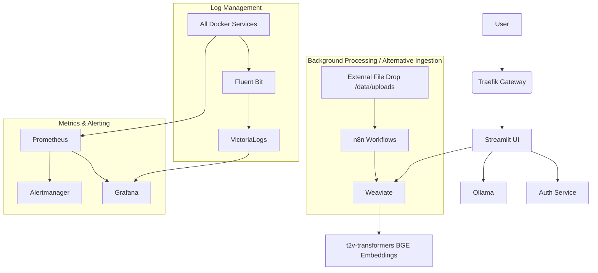

# PrivateGPT Legal AI - Project Structure

This document outlines the complete file structure for the PrivateGPT Legal AI system.

## 📁 Complete Directory Structure

```
privategpt/
├── 📄 README.md                           # Main documentation
├── 📄 PROJECT_STRUCTURE.md               # This file
├── 📄 docker-compose.yml                 # Main orchestration file
├── 📄 env.example                        # Environment template for core services
├── 📄 config.env.example                 # Environment template for UI/auth (potentially different)
├── 🔧 setup.sh                          # Automated setup script
├── 📄 Makefile                          # Management commands (optional)
├── 📄 requirements.txt                   # Python dependencies for some host scripts (e.g., download_test_datasets.py)
├── 📄 download_test_datasets.py          # Script to download test datasets
├── 📄 weaviate_service.py                # Host script related to Weaviate (details TBD)
├── 📄 client_example.py                  # Example client for interacting with services
├── 📄 .gitignore                         # Specifies intentionally untracked files for Git
│
├── 🐳 docker/                           # Container definitions
│   ├── auth-service/                    # JWT Authentication service
│   │   ├── Dockerfile
│   │   ├── requirements.txt
│   │   ├── auth_service.py              # Main auth service logic
│   │   └── utils.py                     # Audit logging and security utilities
│   │
│   ├── streamlit/                       # Web UI application
│   │   ├── Dockerfile
│   │   ├── requirements.txt
│   │   ├── app.py                       # Main Streamlit app (login page)
│   │   ├── pages_utils.py               # Shared utilities for Streamlit pages
│   │   ├── .streamlit/                  # Streamlit configuration (e.g., config.toml)
│   │   ├── pages/                       # Streamlit multi-page app pages
│   │   │   ├── dashboard.py
│   │   │   ├── document_management.py
│   │   │   ├── rag_chat.py
│   │   │   ├── llm_chat.py
│   │   │   ├── admin_panel.py
│   │   │   └── __init__.py
│   │   └── utils/                       # UI utilities
│   │       ├── auth_client.py           # Client for auth-service
│   │       ├── rag_engine.py            # RAG logic with Weaviate and Ollama
│   │       ├── document_processor.py    # Text extraction from documents
│   │       └── logger.py                # UI-specific logging
│   │
│   └── n8n/                            # Workflow automation (manual workflow import)
│       └── Dockerfile                   # (Workflows are manually imported, not in codebase)
│
├── ⚙️ config/                           # Service configurations
│   ├── traefik/                        # Reverse proxy config
│   │   └── traefik.yml                  # Static Traefik configuration
│   │
│   ├── prometheus/                     # Metrics collection
│   │   ├── prometheus.yml              # Main Prometheus config
│   │   └── alerts.yml                  # Alerting rules
│   │
│   ├── grafana/                        # Monitoring dashboards
│   │   ├── datasources/
│   │   │   └── datasources.yml         # Grafana datasource definitions (Prometheus, VictoriaLogs)
│   │   └── dashboards/
│   │       ├── dashboards.yml          # Grafana dashboard provider configuration
│   │       └── json/                   # Dashboard JSON files
│   │           ├── docker-services-logs-dashboard.json
│   │           ├── legal-compliance-dashboard.json
│   │           └── privategpt-dashboard.json
│   │
│   ├── fluent-bit/                     # Log collection and forwarding
│   │   ├── fluent-bit.conf             # Fluent Bit main configuration
│   │   └── parsers.conf                # Fluent Bit parser configurations
│   │
│   └── alertmanager/                   # Alert management (config not shown, default assumed)
│       └── alertmanager.yml            # (If specific config is needed)
│
├── 📊 data/                            # Application data (persistent volumes typically map here or similar)
│   ├── uploads/                        # Document upload staging (used by Streamlit and n8n)
│   └── backups/                        # Placeholder for automated backups
│
├── 📋 logs/                            # Host-mapped log directories for services
│   ├── audit/                          # (Potentially for auth-service audit logs if mapped)
│   ├── security/                       # (Potentially for auth-service security alerts if mapped)
│   ├── auth/                           # Logs from auth-service
│   ├── app/                            # Logs from streamlit-app
│   ├── ollama/                         # Logs from ollama service
│   ├── weaviate/                       # Logs from weaviate service
│   ├── n8n/                            # Logs from n8n service
│   └── grafana/                        # Logs from grafana service
│
├── 📚 docs/                            # Documentation (placeholder, not explored)
│   ├── api/
│   ├── compliance/
│   ├── deployment/
│   └── user-manual/
│
└── 🧪 scripts/                         # Utility scripts
    ├── init-ollama.sh                 # Initializes Ollama models
    └── setup-n8n-workflows.sh         # Prepares for manual n8n workflow import
```

## 📋 Key Components

### 🐳 Docker Services

| Service            | Description                               | Exposed Port | Internal Port | Purpose                                  |
|--------------------|-------------------------------------------|--------------|---------------|------------------------------------------|
| **traefik**        | Reverse proxy & load balancer             | 80, 443, 8080| 80, 443, 8080 | Unified access point, Dashboard          |
| **auth-service**   | JWT authentication                        | (via Traefik)| 8000          | User management & security               |
| **streamlit-app**  | Web UI application                        | (via Traefik)| 8501          | Main user interface                      |
| **ollama**         | LLM serving (LLaMA-3)                     | (via Traefik)| 11434         | AI inference engine                      |
| **weaviate**       | Vector database                           | (via Traefik)| 8080          | Document search & RAG                    |
| **t2v-transformers**| BGE embeddings for Weaviate             | (internal)   | 8080          | Text embedding generation                |
| **n8n**            | Document processing & workflow automation | (via Traefik)| 5678          | Workflow automation (manual import)      |
| **prometheus**     | Metrics collection                        | (via Traefik)| 9090          | System monitoring                        |
| **grafana**        | Visualization & dashboards                | (via Traefik)| 3000          | Monitoring dashboards                    |
| **victorialogs**   | Log aggregation                           | (via Traefik)| 9428          | Centralized logging                      |
| **fluent-bit**     | Log collection and forwarding             | (internal)   | 2020 (HTTP)   | Log shipping to VictoriaLogs             |
| **alertmanager**   | Alert routing                             | (via Traefik)| 9093          | Compliance & system alerts               |

### 🔐 Security Features

- **JWT Authentication:** Secure token-based auth with 8-hour expiration
- **Role-based Access:** Admin, Partner, Associate, Paralegal roles
- **Client Matter Segregation:** Data isolation by legal matter
- **Audit Logging:** 7-year retention with immutable logs
- **PII Redaction:** Automatic removal of sensitive data from logs
- **Encryption:** LUKS disk encryption for all persistent data

### 📊 Monitoring & Compliance

- **Legal Compliance Metrics:** Authentication, document access, AI usage
- **Performance Monitoring:** Response times, resource usage, availability
- **Security Alerts:** Failed logins, unauthorized access, data breaches
- **Business Intelligence:** Billable hours, client usage, ROI analysis

### 🔄 Data Flow



## 🚀 Deployment Process

1. **Environment Setup:** Configure `.env` with secure credentials
2. **Service Deployment:** Run `docker-compose up -d` to start all services
3. **Model Download:** Ollama pulls LLaMA-3 model (8B for dev, 70B for prod)
4. **Schema Initialization:** Weaviate creates document schema
5. **User Creation:** Default admin user created automatically
6. **Health Verification:** All services checked for proper startup

## 📈 Scaling Considerations

### Single-Instance (Current)
- **Target:** 1-50 users
- **Hardware:** RTX 4090 or A100 80GB
- **Cost:** $300-1200/month

### Multi-Instance (Future)
- **Target:** 50+ users
- **Architecture:** Kubernetes deployment
- **Features:** Load balancing, auto-scaling, HA

## 🔧 Configuration Files

### Environment Variables (`.env`)
- Security credentials (JWT secrets, API keys)
- Model configuration (LLaMA variants)
- Resource limits and timeouts
- Legal compliance settings

### Docker Compose (`docker-compose.yml`)
- Service definitions and dependencies
- Network configuration
- Volume mounts and persistence
- Health checks and restart policies

### Monitoring Configuration
- **Prometheus:** Service discovery and scraping
- **Grafana:** Legal-specific dashboards
- **AlertManager:** Compliance violation alerts

## 🛡️ Security Architecture

### Authentication Flow
1. User login via Streamlit UI
2. Credentials validated by auth service
3. JWT token issued with user roles
4. Token verified for each request
5. Role-based authorization enforced

### Data Protection
- **At Rest:** LUKS full-disk encryption
- **In Transit:** TLS 1.3 for all communications
- **Processing:** Client matter segregation
- **Logging:** PII redaction and structured compliance logs

## 📚 Documentation Structure

- **README.md:** Quick start and overview
- **API Documentation:** Service endpoints and schemas
- **Compliance Guide:** Legal industry requirements
- **User Manual:** End-user instructions
- **Deployment Guide:** Production setup procedures

---

This structure provides a complete, production-ready legal AI system with comprehensive compliance monitoring and professional-grade security controls. 