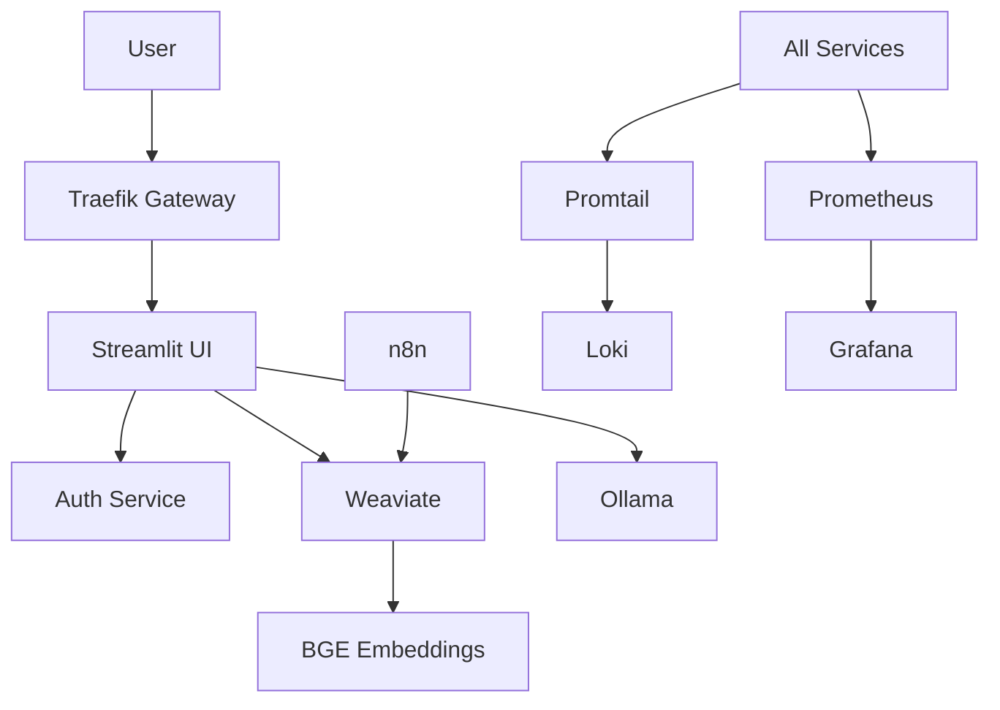

# PrivateGPT Legal AI - Project Structure

This document outlines the complete file structure for the PrivateGPT Legal AI system.

## 📁 Complete Directory Structure

```
privategpt/
├── 📄 README.md                           # Main documentation
├── 📄 PROJECT_STRUCTURE.md               # This file
├── 📄 docker-compose.yml                 # Main orchestration file
├── 📄 env.example                        # Environment template
├── 🔧 setup.sh                          # Automated setup script
├── 📄 Makefile                          # Management commands (optional)
│
├── 🐳 docker/                           # Container definitions
│   ├── auth-service/                    # JWT Authentication service
│   │   ├── Dockerfile
│   │   ├── requirements.txt
│   │   ├── auth_service.py              # Main auth service
│   │   └── utils.py                     # Compliance utilities
│   │
│   ├── streamlit/                       # Web UI application
│   │   ├── Dockerfile
│   │   ├── requirements.txt
│   │   ├── streamlit_app.py             # Main Streamlit app
│   │   └── utils/                       # UI utilities
│   │       ├── auth_client.py           # Auth service client
│   │       ├── rag_engine.py            # RAG integration
│   │       ├── document_processor.py    # Document handling
│   │       └── logger.py                # UI logging
│   │
│   └── n8n/                            # Document processing
│       ├── Dockerfile
│       └── workflows/                   # n8n workflow definitions
│
├── ⚙️ config/                           # Service configurations
│   ├── traefik/                        # Reverse proxy config
│   │   ├── traefik.yml
│   │   └── dynamic.yml
│   │
│   ├── prometheus/                     # Metrics collection
│   │   ├── prometheus.yml              # Main Prometheus config
│   │   └── alerts.yml                  # Legal compliance alerts
│   │
│   ├── grafana/                        # Monitoring dashboards
│   │   ├── datasources.yml             # Data source config
│   │   └── dashboards/                 # Legal-specific dashboards
│   │       ├── executive-dashboard.json
│   │       ├── compliance-dashboard.json
│   │       └── operations-dashboard.json
│   │
│   ├── loki/                           # Log aggregation
│   │   └── loki.yml
│   │
│   ├── promtail/                       # Log collection
│   │   └── promtail.yml
│   │
│   └── alertmanager/                   # Alert management
│       └── alertmanager.yml
│
├── 📊 data/                            # Application data
│   ├── uploads/                        # Document upload staging
│   └── backups/                        # Automated backups
│
├── 📋 logs/                            # Structured logging
│   ├── audit/                          # Legal compliance logs
│   ├── security/                       # Security event logs
│   ├── auth/                           # Authentication logs
│   ├── app/                            # Application logs
│   ├── ollama/                         # LLM service logs
│   ├── weaviate/                       # Vector DB logs
│   ├── n8n/                            # Workflow logs
│   └── grafana/                        # Monitoring logs
│
├── 📚 docs/                            # Documentation
│   ├── api/                            # API documentation
│   ├── compliance/                     # Legal compliance guides
│   ├── deployment/                     # Deployment guides
│   └── user-manual/                    # User documentation
│
├── 🧪 scripts/                         # Utility scripts
│   ├── init-weaviate-schema.py         # Database initialization
│   ├── test-deployment.py              # System validation
│   ├── backup-data.sh                  # Backup automation
│   └── restore-data.sh                 # Restore procedures
│
└── 🔧 tools/                           # Development tools
    ├── monitoring/                     # Monitoring utilities
    ├── compliance/                     # Compliance checking
    └── performance/                    # Performance testing
```

## 📋 Key Components

### 🐳 Docker Services

| Service | Description | Port | Purpose |
|---------|-------------|------|---------|
| **traefik** | Reverse proxy & load balancer | 80, 443 | Unified access point |
| **auth-service** | JWT authentication | 8000 | User management & security |
| **streamlit-app** | Web UI application | 8501 | Main user interface |
| **ollama** | LLM serving (LLaMA-3) | 11434 | AI inference engine |
| **weaviate** | Vector database | 8080 | Document search & RAG |
| **t2v-transformers** | BGE embeddings | 8080 | Text embedding generation |
| **n8n** | Document processing | 5678 | Workflow automation |
| **prometheus** | Metrics collection | 9090 | System monitoring |
| **grafana** | Visualization & alerts | 3000 | Compliance dashboards |
| **loki** | Log aggregation | 3100 | Centralized logging |
| **promtail** | Log collection | - | Log shipping |
| **alertmanager** | Alert routing | 9093 | Compliance alerts |

### 🔐 Security Features

- **JWT Authentication:** Secure token-based auth with 8-hour expiration
- **Role-based Access:** Admin, Partner, Associate, Paralegal roles
- **Client Matter Segregation:** Data isolation by legal matter
- **Audit Logging:** 7-year retention with immutable logs
- **PII Redaction:** Automatic removal of sensitive data from logs
- **Encryption:** LUKS disk encryption for all persistent data

### 📊 Monitoring & Compliance

- **Legal Compliance Metrics:** Authentication, document access, AI usage
- **Performance Monitoring:** Response times, resource usage, availability
- **Security Alerts:** Failed logins, unauthorized access, data breaches
- **Business Intelligence:** Billable hours, client usage, ROI analysis

### 🔄 Data Flow



## 🚀 Deployment Process

1. **Environment Setup:** Configure `.env` with secure credentials
2. **Service Deployment:** Run `docker-compose up -d` to start all services
3. **Model Download:** Ollama pulls LLaMA-3 model (8B for dev, 70B for prod)
4. **Schema Initialization:** Weaviate creates document schema
5. **User Creation:** Default admin user created automatically
6. **Health Verification:** All services checked for proper startup

## 📈 Scaling Considerations

### Single-Instance (Current)
- **Target:** 1-50 users
- **Hardware:** RTX 4090 or A100 80GB
- **Cost:** $300-1200/month

### Multi-Instance (Future)
- **Target:** 50+ users
- **Architecture:** Kubernetes deployment
- **Features:** Load balancing, auto-scaling, HA

## 🔧 Configuration Files

### Environment Variables (`.env`)
- Security credentials (JWT secrets, API keys)
- Model configuration (LLaMA variants)
- Resource limits and timeouts
- Legal compliance settings

### Docker Compose (`docker-compose.yml`)
- Service definitions and dependencies
- Network configuration
- Volume mounts and persistence
- Health checks and restart policies

### Monitoring Configuration
- **Prometheus:** Service discovery and scraping
- **Grafana:** Legal-specific dashboards
- **AlertManager:** Compliance violation alerts

## 🛡️ Security Architecture

### Authentication Flow
1. User login via Streamlit UI
2. Credentials validated by auth service
3. JWT token issued with user roles
4. Token verified for each request
5. Role-based authorization enforced

### Data Protection
- **At Rest:** LUKS full-disk encryption
- **In Transit:** TLS 1.3 for all communications
- **Processing:** Client matter segregation
- **Logging:** PII redaction and structured compliance logs

## 📚 Documentation Structure

- **README.md:** Quick start and overview
- **API Documentation:** Service endpoints and schemas
- **Compliance Guide:** Legal industry requirements
- **User Manual:** End-user instructions
- **Deployment Guide:** Production setup procedures

---

This structure provides a complete, production-ready legal AI system with comprehensive compliance monitoring and professional-grade security controls. 