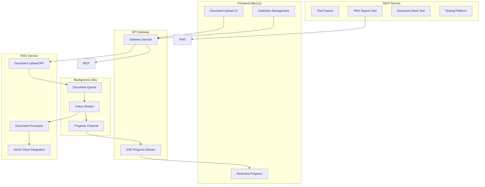

# RAG & MCP Integration Roadmap

## Executive Summary

This roadmap outlines the implementation of a comprehensive document management and retrieval system (RAG) integrated with Model Context Protocol (MCP) tools, enabling users to organize documents into collections and folders, upload documents, and leverage AI with contextual awareness.

## 🎯 Vision

Create a powerful knowledge management system where users can:
- Organize documents into collections and folders (hierarchical structure)
- Upload and process documents with real-time progress tracking
- Use AI that understands and accesses specific context via @ mentions
- Leverage MCP tools for intelligent document search and manipulation

## 🏗️ Architecture Overview



## 📋 Core Concepts

### 1. Collections & Folders (Hierarchical Organization)

**Definition**: Hierarchical document organization with collections (top-level) and folders (nested).

**Use Cases**:
- **Legal**: Collections for "Cases", "Regulations" with nested folders for specific cases/jurisdictions
- **Research**: "Projects" collection with folders for each study, "References" with subject folders
- **Business**: "Operations", "Compliance" collections with departmental folders

**Data Model**:
```python
class Collection:
    id: UUID
    user_id: str
    parent_id: Optional[UUID]  # None for root collections
    name: str
    description: str
    collection_type: Literal["collection", "folder"]
    icon: str  # emoji or icon identifier
    color: str  # for UI theming
    path: str  # Full path like "/Cases/Smith v Jones"
    depth: int  # 0 for root collections
    created_at: datetime
    settings: CollectionSettings
    
class CollectionSettings:
    is_public: bool = False
    default_chunk_size: int = 512
    embedding_model: str = "BAAI/bge-small-en-v1.5"
    retention_days: Optional[int] = None
```

### 2. Document Processing Pipeline

**Flow**:
1. User uploads document to specific collection/folder
2. API creates document record with "pending" status
3. Celery task queued for processing
4. Progress updates streamed via SSE
5. Document chunked, embedded, and stored in vector DB
6. Status updated to "completed" with metadata

**Progress Tracking**:
```python
class ProcessingProgress:
    document_id: UUID
    status: Literal["pending", "processing", "embedding", "storing", "completed", "failed"]
    current_step: str
    progress_percentage: int
    chunks_processed: int
    total_chunks: int
    error_message: Optional[str]
```

### 3. @ Mention Context System

**Frontend Behavior**:
- User types `@` to see available workspaces/documents
- Selecting context adds visual tag in message
- Multiple contexts can be selected
- Context sent with message as metadata

**Backend Processing**:
```python
class MessageContext:
    workspace_ids: List[UUID]
    document_ids: List[UUID]
    search_scope: Literal["workspace", "document", "all"]
    max_results: int = 10
```

## 🛠️ Implementation Phases

### Phase 1: RAG Service Foundation (Week 1-2)

#### 1.1 Workspace Management API
```python
# Endpoints
POST   /api/rag/workspaces                 # Create workspace
GET    /api/rag/workspaces                 # List user workspaces
GET    /api/rag/workspaces/{id}           # Get workspace details
PATCH  /api/rag/workspaces/{id}           # Update workspace
DELETE /api/rag/workspaces/{id}           # Delete workspace (soft delete)
```

#### 1.2 Document Upload & Management
```python
# Endpoints
POST   /api/rag/workspaces/{id}/documents # Upload document
GET    /api/rag/documents                  # List all user documents
GET    /api/rag/documents/{id}            # Get document details
DELETE /api/rag/documents/{id}            # Delete document
GET    /api/rag/documents/{id}/chunks     # Get document chunks
```

#### 1.3 Database Schema Updates
```sql
-- Workspaces table
CREATE TABLE workspaces (
    id UUID PRIMARY KEY,
    user_id VARCHAR NOT NULL,
    name VARCHAR NOT NULL,
    description TEXT,
    icon VARCHAR,
    color VARCHAR,
    settings JSONB,
    created_at TIMESTAMP,
    updated_at TIMESTAMP,
    deleted_at TIMESTAMP
);

-- Documents table update
ALTER TABLE documents 
ADD COLUMN workspace_id UUID REFERENCES workspaces(id),
ADD COLUMN processing_status VARCHAR,
ADD COLUMN processing_progress JSONB,
ADD COLUMN error_details JSONB;

-- Chunks table update
ALTER TABLE chunks
ADD COLUMN workspace_id UUID REFERENCES workspaces(id);
```

### Phase 2: Async Processing Pipeline (Week 2-3)

#### 2.1 Celery Task Structure
```python
@celery_app.task(bind=True)
def process_document(self, document_id: str, workspace_id: str):
    """Main document processing task with progress tracking"""
    try:
        # Update status
        update_progress(document_id, "processing", 0)
        
        # Load document
        doc = load_document(document_id)
        update_progress(document_id, "processing", 20)
        
        # Split into chunks
        chunks = split_document(doc)
        update_progress(document_id, "chunking", 40)
        
        # Generate embeddings
        for i, chunk in enumerate(chunks):
            embedding = generate_embedding(chunk)
            store_chunk(chunk, embedding, workspace_id)
            progress = 40 + (40 * (i + 1) / len(chunks))
            update_progress(document_id, "embedding", progress)
        
        # Update vector store
        update_vector_store(workspace_id)
        update_progress(document_id, "completed", 100)
        
    except Exception as e:
        update_progress(document_id, "failed", error=str(e))
```

#### 2.2 Progress Streaming via SSE
```python
# Gateway endpoint
@router.get("/api/rag/documents/{id}/progress")
async def stream_document_progress(id: str):
    async def event_generator():
        redis_channel = f"doc_progress:{id}"
        async for message in redis_subscribe(redis_channel):
            yield f"data: {message}\n\n"
    
    return StreamingResponse(event_generator(), media_type="text/event-stream")
```

### Phase 3: MCP Tool Integration (Week 3-4)

#### 3.1 RAG Search Tool
```python
class RAGSearchTool:
    name = "search_knowledge"
    description = "Search through uploaded documents in collections and folders"
    
    parameters = {
        "query": str,
        "collection_ids": Optional[List[str]],
        "document_ids": Optional[List[str]],
        "max_results": int = 5,
        "include_metadata": bool = True
    }
    
    async def execute(self, **params) -> Dict:
        # Perform vector search
        results = await vector_search(
            query=params["query"],
            filters=build_filters(params),
            limit=params["max_results"]
        )
        
        # Format results with context
        return {
            "results": [
                {
                    "content": r.content,
                    "document": r.document_name,
                    "collection_path": r.collection_path,
                    "relevance": r.score,
                    "metadata": r.metadata if params["include_metadata"] else None
                }
                for r in results
            ]
        }
```

#### 3.2 Document Management Tool
```python
class DocumentManagementTool:
    name = "manage_documents"
    description = "List, filter, and get information about documents"
    
    parameters = {
        "action": Literal["list", "search", "get_metadata"],
        "collection_id": Optional[str],
        "filters": Optional[Dict],
        "document_id": Optional[str]
    }
    
    async def execute(self, **params) -> Dict:
        if params["action"] == "list":
            return await list_documents(params.get("collection_id"), params.get("filters"))
        elif params["action"] == "search":
            return await search_documents(params.get("filters"))
        elif params["action"] == "get_metadata":
            return await get_document_metadata(params["document_id"])
```

#### 3.3 Tool Factory System
```python
class MCPToolFactory:
    def __init__(self):
        self._tools = {}
        self._register_default_tools()
    
    def register_tool(self, tool_class: Type[BaseTool]):
        tool = tool_class()
        self._tools[tool.name] = tool
    
    def get_available_tools(self, user_context: Dict) -> List[Dict]:
        """Return tools available for user's context"""
        available = []
        for name, tool in self._tools.items():
            if tool.is_available_for_user(user_context):
                available.append({
                    "name": tool.name,
                    "description": tool.description,
                    "parameters": tool.parameters
                })
        return available
    
    async def execute_tool(self, name: str, params: Dict, user_context: Dict) -> Dict:
        if name not in self._tools:
            raise ToolNotFoundError(f"Tool {name} not found")
        
        tool = self._tools[name]
        if not tool.is_available_for_user(user_context):
            raise ToolNotAuthorizedError(f"User cannot access tool {name}")
        
        return await tool.execute(**params)
```

### Phase 4: Frontend Integration (Week 4-5)

#### 4.1 Workspace UI Components
```typescript
// Workspace selector component
interface WorkspaceSelector {
  workspaces: Workspace[]
  onSelect: (workspace: Workspace) => void
  multiSelect?: boolean
}

// Document upload with progress
interface DocumentUpload {
  workspaceId: string
  onProgress: (progress: ProcessingProgress) => void
  onComplete: (document: Document) => void
  onError: (error: Error) => void
}

// @ mention context selector
interface ContextSelector {
  onContextSelect: (context: MessageContext) => void
  availableWorkspaces: Workspace[]
  availableDocuments: Document[]
}
```

#### 4.2 Real-time Progress Tracking
```typescript
// SSE client for progress updates
class DocumentProgressTracker {
  private eventSource: EventSource | null = null
  
  trackDocument(documentId: string, callbacks: ProgressCallbacks) {
    const url = `/api/rag/documents/${documentId}/progress`
    this.eventSource = new EventSource(url)
    
    this.eventSource.onmessage = (event) => {
      const progress = JSON.parse(event.data) as ProcessingProgress
      callbacks.onProgress(progress)
      
      if (progress.status === 'completed') {
        callbacks.onComplete()
        this.cleanup()
      } else if (progress.status === 'failed') {
        callbacks.onError(new Error(progress.error_message))
        this.cleanup()
      }
    }
  }
  
  cleanup() {
    this.eventSource?.close()
    this.eventSource = null
  }
}
```

### Phase 5: Testing & Quality Assurance (Week 5-6)

#### 5.1 MCP Testing Framework
```python
class MCPTestRunner:
    def __init__(self):
        self.test_cases = []
        self.results = []
    
    def add_test_case(self, test: MCPTestCase):
        self.test_cases.append(test)
    
    async def run_tests(self) -> TestReport:
        for test in self.test_cases:
            result = await self._run_single_test(test)
            self.results.append(result)
        
        return TestReport(
            total=len(self.test_cases),
            passed=sum(1 for r in self.results if r.passed),
            failed=sum(1 for r in self.results if not r.passed),
            details=self.results
        )
    
    async def _run_single_test(self, test: MCPTestCase) -> TestResult:
        try:
            # Setup test context
            context = await test.setup()
            
            # Execute tool
            result = await self.tool_factory.execute_tool(
                test.tool_name,
                test.parameters,
                context
            )
            
            # Validate result
            passed = test.validate(result)
            
            return TestResult(
                test_name=test.name,
                passed=passed,
                execution_time=test.execution_time,
                result=result
            )
        except Exception as e:
            return TestResult(
                test_name=test.name,
                passed=False,
                error=str(e)
            )
```

#### 5.2 Integration Tests
```python
# Test collection creation and document upload
async def test_full_document_pipeline():
    # Create collection hierarchy
    cases_collection = await create_collection("Cases", user_id=1)
    smith_folder = await create_collection("Smith v Jones", parent_id=cases_collection.id)
    
    # Upload document
    doc_id = await upload_document(smith_folder.id, "case1.pdf")
    
    # Track progress
    progress = await track_document_progress(doc_id)
    assert progress.status == "completed"
    
    # Search via MCP with path
    results = await mcp_search("specific legal term", collection_ids=[smith_folder.id])
    assert len(results) > 0
```

## 📊 Success Metrics

1. **Performance**
   - Document processing: < 30s for 10MB PDF
   - Search latency: < 200ms for vector search
   - Progress updates: Real-time with < 100ms delay

2. **Reliability**
   - Document processing success rate: > 99%
   - Search accuracy: > 90% relevance score
   - System uptime: > 99.9%

3. **User Experience**
   - Workspace switching: Instant
   - Context selection: < 50ms response
   - Progress visualization: Smooth, real-time

## 🚧 Technical Considerations

### 1. Scalability
- Use Redis Streams for progress tracking
- Implement document processing queue with priority
- Consider S3 for document storage at scale

### 2. Security
- Workspace-level access control
- Document encryption at rest
- Audit logging for all operations

### 3. Performance
- Chunk caching for frequently accessed documents
- Background index optimization
- Lazy loading for large workspaces

## 🗓️ Timeline

**Weeks 1-2**: RAG Service Foundation
- Collection hierarchy CRUD APIs
- Folder navigation and management
- Document upload with collection support
- Database schema updates

**Weeks 2-3**: Async Processing
- Celery pipeline setup
- Progress tracking implementation
- SSE streaming integration

**Weeks 3-4**: MCP Integration
- Collection-aware search tool
- Path-based context filtering
- Tool factory system
- Testing framework

**Weeks 4-5**: Frontend Features
- Collection browser UI
- Folder tree navigation
- @ mention with path support
- Progress visualization

**Weeks 5-6**: Testing & Polish
- Integration tests
- Performance optimization
- Documentation

## 🎯 Next Immediate Steps

1. **Database Migration**: Create collections table with hierarchy support
2. **API Scaffolding**: Implement collection/folder CRUD endpoints
3. **Celery Setup**: Configure async document processing
4. **Frontend Mockups**: Design collection browser and folder navigation
5. **MCP Tool Stub**: Create basic RAG search tool interface

This roadmap provides a systematic approach to building a powerful knowledge management system with RAG and MCP integration. The modular design allows for iterative development while maintaining a clear vision of the end goal.