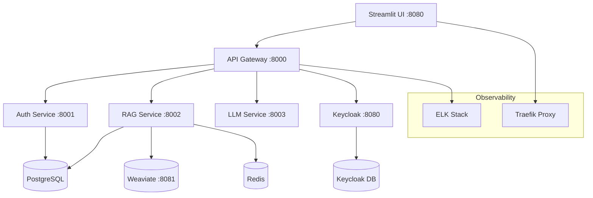

# PrivateGPT v2 🚀

> **Self-hosted, privacy-first RAG system with enterprise authentication**

[](https://www.python.org/downloads/)
[](https://fastapi.tiangolo.com/)
[](https://docs.docker.com/compose/)
[](LICENSE)

**PrivateGPT v2** is a production-ready, self-hosted Retrieval-Augmented Generation (RAG) system that lets you chat with your documents while keeping your data completely private. Built with modern microservices architecture, enterprise authentication, Model Context Protocol (MCP) integration, and comprehensive developer tools.

## ✨ Features

### 🔒 **Privacy & Security**
- **100% Self-hosted** - Your data never leaves your infrastructure
- **Enterprise SSO** - Keycloak integration with LDAP, SAML, OAuth2 support
- **Role-based Access** - Fine-grained permissions and user management
- **API Gateway** - Centralized security, rate limiting, and request routing

### 🧠 **AI & RAG Capabilities**
- **Document Processing** - PDF, TXT, and more format support
- **Semantic Search** - Vector-based document retrieval with Weaviate
- **Advanced Chunking** - Intelligent text segmentation for optimal context
- **BGE Embeddings** - State-of-the-art multilingual embeddings
- **LLM Integration** - Ready for Ollama, OpenAI, or custom models
- **Model Context Protocol (MCP)** - Local tool execution for enhanced AI capabilities
- **Thinking Display** - AI reasoning visualization (similar to DeepSeek R1)
- **Tool Execution Tracking** - Real-time monitoring of AI tool usage

### 🏗️ **Modern Architecture**
- **Microservices** - Independent, scalable service architecture
- **API-First** - RESTful APIs with OpenAPI documentation
- **Async Operations** - Non-blocking I/O for high performance
- **Container Native** - Docker Compose with health checks
- **Observability** - ELK stack with structured logging

### 🎨 **User Experience**
- **Streamlit UI** - Intuitive web interface for document management and chat
- **Real-time Chat** - Interactive Q&A with document sources
- **Developer Testing Interface** - Comprehensive debugging and testing dashboard
- **Advanced Chat Features** - System prompt management, model switching, conversation persistence
- **Debug Toggles** - Show/hide thinking content, tool calls, raw responses
- **Mobile Responsive** - Works on desktop and mobile devices

## 🏛️ Architecture



### Service Overview

| Service | Port | Purpose | Technology |
|---------|------|---------|------------|
| **API Gateway** | 8000 | Authentication, routing, MCP integration | FastAPI + Keycloak + MCP |
| **RAG Service** | 8001 | Document processing, Q&A | FastAPI + Weaviate + BGE |
| **LLM Service** | 8003 | Language model integration | FastAPI + Ollama |
| **UI Service** | 8080 | Developer testing interface | Streamlit |
| **Keycloak** | 8180 | Authentication provider | Keycloak + PostgreSQL |
| **Weaviate** | 8081 | Vector database | Weaviate |
| **MCP Server** | - | Local tool execution | STDIO transport |

## 🚀 Quick Start

Get PrivateGPT v2 running in under 5 minutes:

```bash
# 1. Clone the repository
git clone https://github.com/your-org/privategpt-v2.git
cd privategpt-v2

# 2. Run the setup script
./scripts/setup-keycloak.sh

# 3. Access the application
open http://localhost:8080
```

**Default Login:**
- **Email:** `admin@admin.com`
- **Password:** `admin`
- **Customizable**: Edit `config.json` or set `DEFAULT_ADMIN_EMAIL`/`DEFAULT_ADMIN_PASSWORD` environment variables

**Install Models:**
```bash
# Install a model after setup
make install-model MODEL=tinydolphin:latest  # Recommended: fast and lightweight
make install-model MODEL=llama3.2:3b        # Alternative: better quality
make list-models
```

## 📋 Prerequisites

- **Docker** 20.10+ with Docker Compose
- **8GB+ RAM** (for ML models)
- **10GB+ Storage** (for documents and models)
- **Python 3.11+** (for development)

## 🛠️ Installation

### Option 1: Automated Setup (Recommended)

```bash
# Clone and setup everything automatically
git clone https://github.com/your-org/privategpt-v2.git
cd privategpt-v2
./scripts/setup-keycloak.sh
```

### Option 2: Manual Setup

```bash
# 1. Build base image with dependencies
make build-base

# 2. Start infrastructure services
docker-compose up -d keycloak-db keycloak db redis weaviate

# 3. Wait for Keycloak to be ready
curl -f http://localhost:8180/health/ready

# 4. Start application services
docker-compose up -d gateway-service auth-service rag-service ui-service

# 5. Check all services are healthy
make status
```

### Option 3: Development Setup

```bash
# 1. Install Python dependencies
pip install -e .

# 2. Start only infrastructure
docker-compose up -d db keycloak redis weaviate

# 3. Run services locally
python -m privategpt.services.gateway.main &
python -m privategpt.services.auth.main &
python -m privategpt.services.rag.main &
streamlit run src/privategpt/services/ui/app.py
```

## 💡 Usage

### 📄 Upload Documents

1. **Access UI:** Navigate to http://localhost:8080
2. **Login:** Use admin credentials or create a new account
3. **Upload:** Go to "Document Management" and upload PDFs or text files
4. **Process:** Wait for documents to be processed (check status tab)

### 💬 Chat with Documents

1. **Navigate:** Go to "Enhanced LLM Chat" page for full features
2. **Choose Model:** Select tinydolphin:latest or other installed models
3. **Ask Questions:** Type questions with tool execution and thinking display
4. **Debug Features:** Toggle thinking content, tool calls, and raw responses
5. **System Prompts:** Customize AI behavior with XML-structured prompts

### 👥 User Management

1. **Keycloak Admin:** Access http://localhost:8180
2. **Login:** Username: `admin`, Password: `admin123`
3. **Manage Users:** Create users, assign roles, configure SSO
4. **API Access:** Use `/api/admin/*` endpoints for programmatic management

## 🔧 Configuration

### Environment Variables

```bash
# Database
DATABASE_URL=postgresql://privategpt:secret@db:5432/privategpt
REDIS_URL=redis://redis:6379/0
WEAVIATE_URL=http://weaviate:8080

# Authentication
KEYCLOAK_URL=http://keycloak:8080
KEYCLOAK_REALM=privategpt
KEYCLOAK_CLIENT_ID=privategpt-api

# Services
GATEWAY_URL=http://gateway-service:8000
AUTH_SERVICE_URL=http://auth-service:8000
RAG_SERVICE_URL=http://rag-service:8000

# ML Models
EMBED_MODEL=BAAI/bge-small-en-v1.5
OLLAMA_URL=http://ollama:11434
```

### Advanced Configuration

The system uses a **configuration hierarchy**:
1. **Environment Variables** (highest priority)
2. **config.json** file settings
3. **Pydantic defaults** (fallback)

#### Default config.json
A default `config.json` is provided with sensible defaults:

```json
{
  "default_admin": {
    "email": "admin@admin.com",
    "username": "admin@admin.com", 
    "password": "admin"
  },
  "database": {
    "url": "postgresql://privategpt:secret@db:5432/privategpt"
  },
  "llm": {
    "ollama_url": "http://ollama:11434",
    "ollama_model": "tinydolphin:latest"
  },
  "embedding": {
    "model": "BAAI/bge-small-en-v1.5"
  },
  "mcp": {
    "enabled": true,
    "transport": "stdio",
    "server_command": ["python", "-m", "privategpt.services.mcp.main"]
  },
  "system_prompts": {
    "default": "<persona>You are PrivateGPT...</persona>",
    "enable_thinking_mode": true
  }
}
```

#### Environment Variable Overrides
```bash
# Customize admin user
export DEFAULT_ADMIN_EMAIL="myemail@company.com"
export DEFAULT_ADMIN_PASSWORD="secure-password"

# Use different LLM model
export OLLAMA_MODEL="llama3.2:7b"
```

## 📚 API Documentation

### Authentication

```bash
# Login and get access token
curl -X POST http://localhost:8000/api/auth/login \
  -H "Content-Type: application/json" \
  -d '{"email": "admin@admin.com", "password": "admin"}'

# Use token for API calls
curl -H "Authorization: Bearer <token>" \
  http://localhost:8000/api/rag/documents
```

### Document Management

```bash
# Upload document
curl -X POST http://localhost:8000/api/rag/documents \
  -H "Authorization: Bearer <token>" \
  -F "file=@document.pdf"

# List documents  
curl -H "Authorization: Bearer <token>" \
  http://localhost:8000/api/rag/documents

# Get document status
curl -H "Authorization: Bearer <token>" \
  http://localhost:8000/api/rag/documents/{id}/status
```

### RAG Chat

```bash
# Ask a question
curl -X POST http://localhost:8000/api/rag/chat \
  -H "Authorization: Bearer <token>" \
  -H "Content-Type: application/json" \
  -d '{"question": "What is the main topic of the document?"}'
```

**📖 Full API docs available at:** http://localhost:8000/docs

## 🏗️ Development

### Project Structure

```
privategpt-v2/
├── src/privategpt/
│   ├── core/           # Domain models and business logic
│   ├── infra/          # Infrastructure adapters  
│   ├── services/       # Microservices
│   └── shared/         # Shared utilities
├── docker/             # Service Dockerfiles
├── config/             # Configuration files
├── docs/               # Documentation
├── scripts/            # Setup and utility scripts
└── tests/              # Test suites
```

### Running Tests

```bash
# Unit tests (fast)
make test-unit

# Integration tests (requires Docker)
make test

# API tests
make test-api

# Specific service tests
pytest tests/unit/auth/
pytest tests/unit/rag/
```

### Adding New Features

1. **Follow Domain-Driven Design:** Keep business logic in `core/`
2. **Use Ports & Adapters:** Infrastructure in `infra/`, interfaces in `core/ports/`
3. **Service Architecture:** Each service owns its vertical slice
4. **API First:** Design APIs before implementation
5. **Test Coverage:** Write tests for new functionality

### Code Quality

```bash
# Linting and formatting (if configured)
ruff check src/
black src/
mypy src/

# Pre-commit hooks
pre-commit install
pre-commit run --all-files
```

## 🐛 Troubleshooting

### Common Issues

**🔴 Services won't start**
```bash
# Check Docker resources
docker system df
docker system prune -a

# Rebuild from scratch  
make clean
make build
```

**🔴 Authentication failures**
```bash
# Check Keycloak status
curl http://localhost:8180/health/ready

# Reset Keycloak realm
docker-compose restart keycloak
```

**🔴 Document processing stuck**
```bash
# Check RAG service logs
docker-compose logs rag-service

# Check Weaviate connection
curl http://localhost:8081/v1/schema
```

**🔴 Out of memory errors**
```bash
# Increase Docker memory to 8GB+
# Or reduce model size in configuration
```

### Getting Help

- **📋 Check service status:** `make status`
- **📊 View logs:** `docker-compose logs [service-name]`
- **🩺 Health checks:** `curl http://localhost:8000/status`
- **📈 Observability:** http://localhost/logs (Kibana)

## 🤝 Contributing

We welcome contributions! Please see our [Contributing Guidelines](CONTRIBUTING.md).

### Development Workflow

1. **Fork** the repository
2. **Create** a feature branch (`git checkout -b feature/amazing-feature`)
3. **Commit** your changes (`git commit -m 'Add amazing feature'`)
4. **Push** to the branch (`git push origin feature/amazing-feature`)
5. **Open** a Pull Request

### Code of Conduct

This project follows the [Contributor Covenant Code of Conduct](CODE_OF_CONDUCT.md).

## 📄 License

This project is licensed under the MIT License - see the [LICENSE](LICENSE) file for details.

## 🙏 Acknowledgments

- **FastAPI** - Modern web framework for building APIs
- **Streamlit** - Beautiful web apps for machine learning
- **Keycloak** - Open source identity and access management
- **Weaviate** - Open source vector database
- **Sentence Transformers** - State-of-the-art embeddings

## 🔗 Links

- **📚 Documentation:** [docs/](docs/)
- **🐳 Docker Hub:** [privategpt/v2](https://hub.docker.com/r/privategpt/v2)
- **🐛 Issues:** [GitHub Issues](https://github.com/your-org/privategpt-v2/issues)
- **💬 Discussions:** [GitHub Discussions](https://github.com/your-org/privategpt-v2/discussions)

---

<div align="center">

**Made with ❤️ by the PrivateGPT Team**

[⭐ Star us on GitHub](https://github.com/your-org/privategpt-v2) | [📖 Read the Docs](docs/) | [🐛 Report Bug](https://github.com/your-org/privategpt-v2/issues)

</div>
