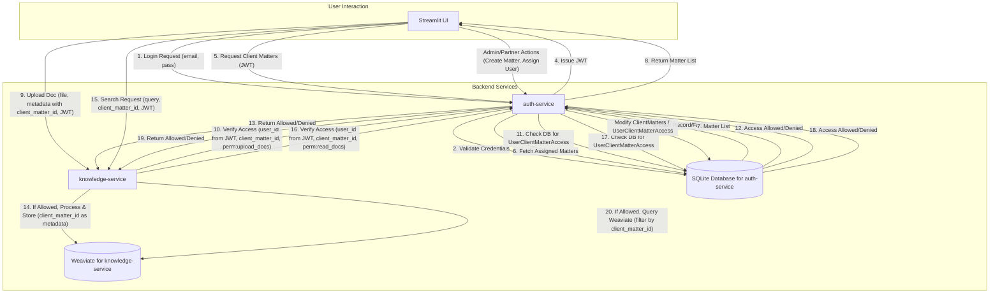

# Technical Design Document: Enhanced Authentication & Authorization Service (`auth-service`)

**Version:** 1.0
**Date:** 2023-10-27 (Placeholder, update as needed)
**Author:** PrivateGPT AI Assistant

## 1. Overview

The `auth-service` is a FastAPI-based microservice responsible for:
*   User authentication (login/JWT issuance).
*   User and role management.
*   Client Matter creation and administration.
*   Managing user access permissions to Client Matters.
*   Providing verification endpoints for other services to check user access rights.

It will use a SQL database (SQLite initially) via SQLAlchemy for data persistence and Alembic for database migrations.

## 2. System Architecture & Data Flow



## 3. Data Models (SQLAlchemy with SQLite)

```mermaid
erDiagram
    User {
        int id PK
        string email UK
        string hashed_password
        int role_id FK
        bool is_active
        datetime created_at
        datetime updated_at
    }

    Role {
        int id PK
        string name UK
        string description
    }

    ClientMatter {
        int id PK
        string name
        string description
        int created_by_user_id FK
        bool is_active
        datetime created_at
        datetime updated_at
    }

    UserClientMatterAccess {
        int id PK
        int user_id FK
        int client_matter_id FK
        int assigned_by_user_id FK
        string role_on_matter "Nullable (e.g., Lead, Contributor)"
        datetime created_at
        UQ (user_id, client_matter_id)
    }

    User ||--o{ Role : "has"
    User ||--o{ ClientMatter : "created (as Partner)"
    User ||--o{ UserClientMatterAccess : "has access to matters via"
    ClientMatter ||--o{ UserClientMatterAccess : "grants access to users via"
    User ||--o{ UserClientMatterAccess : "assigned by (as Partner)"
```

*   **`User` Table:**
    *   `id`: Integer, Primary Key
    *   `email`: String, Unique, Not Null
    *   `hashed_password`: String, Not Null
    *   `role_id`: Integer, Foreign Key to `Role.id`
    *   `is_active`: Boolean, Default True
    *   `created_at`: DateTime, Default UTCNow
    *   `updated_at`: DateTime, Default UTCNow, On Update UTCNow

*   **`Role` Table:**
    *   `id`: Integer, Primary Key
    *   `name`: String, Unique, Not Null (e.g., "Admin", "Partner", "Associate", "Paralegal")
    *   `description`: String, Nullable

*   **`ClientMatter` Table:**
    *   `id`: Integer, Primary Key
    *   `name`: String, Not Null
    *   `description`: String, Nullable
    *   `created_by_user_id`: Integer, Foreign Key to `User.id` (Partner who created it)
    *   `is_active`: Boolean, Default True (for soft deletes/archiving)
    *   `created_at`: DateTime, Default UTCNow
    *   `updated_at`: DateTime, Default UTCNow, On Update UTCNow

*   **`UserClientMatterAccess` Table (Association Table):**
    *   `id`: Integer, Primary Key
    *   `user_id`: Integer, Foreign Key to `User.id`, Not Null
    *   `client_matter_id`: Integer, Foreign Key to `ClientMatter.id`, Not Null
    *   `assigned_by_user_id`: Integer, Foreign Key to `User.id` (Partner who assigned this user)
    *   `role_on_matter`: String, Nullable (e.g., "Lead", "Contributor", "Viewer" - for future fine-grained permissions within a matter, can be simple "assigned" initially)
    *   `created_at`: DateTime, Default UTCNow
    *   *Constraints:* Unique constraint on (`user_id`, `client_matter_id`)

## 4. API Endpoints (FastAPI)

*   **Authentication (`/auth`)**
    *   `POST /token`: Login, returns JWT.
    *   `POST /register`: (Admin only, or configured self-registration) Create a new user.
        *   *Request Body:* `{ "email": "str", "password": "str", "role_name": "str (e.g., Associate)" }` (Admin sets role)
    *   `GET /users/me`: (Authenticated) Get current user's details, including their role and a list of Client Matters they have access to (IDs and names).

*   **Users (`/users`)**
    *   `GET /`: (Admin only) List all users with their roles.
    *   `PUT /{user_id}/role`: (Admin only) Change a user's primary role.
        *   *Request Body:* `{ "role_name": "str" }`
    *   `PUT /{user_id}/status`: (Admin only) Activate/deactivate a user.
        *   *Request Body:* `{ "is_active": "bool" }`

*   **Roles (`/roles`)**
    *   `GET /`: (Authenticated) List all available roles.

*   **Client Matters (`/client-matters`)**
    *   `POST /`: (Requires Partner or Admin role) Create a new Client Matter.
        *   *Request Body:* `{ "name": "str", "description": "str (optional)" }`
        *   *Response:* Full Client Matter object.
    *   `GET /`: (Authenticated) List Client Matters.
        *   Admins see all.
        *   Partners see matters they created OR are assigned to.
        *   Associates/Paralegals see only matters they are assigned to.
        *   *Query Parameters:* `?scope=assigned_to_me` (default), `?scope=created_by_me` (for Partners), `?scope=all` (for Admins).
    *   `GET /{matter_id}`: (Authenticated, requires access to the matter) Get details of a specific Client Matter.
    *   `PUT /{matter_id}`: (Requires Partner who created it, or Admin) Update Client Matter details.
        *   *Request Body:* `{ "name": "str (optional)", "description": "str (optional)", "is_active": "bool (optional)" }`
    *   `DELETE /{matter_id}`: (Requires Partner who created it, or Admin) Deactivate a Client Matter (sets `is_active=false`).

*   **Client Matter Access Management (`/client-matters/{matter_id}/access`)**
    *   `POST /`: (Requires Partner who created/manages the matter, or Admin) Assign a user to this Client Matter.
        *   *Request Body:* `{ "user_id_to_assign": "int", "role_on_matter": "str (optional)" }`
    *   `GET /`: (Requires Partner who created/manages the matter, or Admin) List users assigned to this Client Matter.
    *   `DELETE /{user_id_assigned}`: (Requires Partner who created/manages the matter, or Admin) Remove a user's access to this Client Matter (deletes from `UserClientMatterAccess`).

*   **Verification Endpoint (Internal, for service-to-service calls)**
    *   `GET /internal/verify-access`: (Requires service token or trusted network)
        *   *Query Parameters:* `user_id=<int>`, `client_matter_id=<int>`, `permission_action=<str>` (e.g., "upload_document", "read_document_list", "search_matter")
        *   *Response:* `{ "allowed": true/false, "reason": "str (optional)" }`
        *   *Logic:* Core permission checking based on user's role and `UserClientMatterAccess` entries.

## 5. JWT Claims

*   `sub`: `user_id` (Integer)
*   `email`: User's email (String)
*   `role`: User's primary role name (String, e.g., "Partner")
*   `exp`: Standard JWT expiration claim

*No list of assigned client matters in the JWT to keep it lean. UI/services will fetch this from `/auth/users/me` or `/client-matters` with appropriate scope, or use `/internal/verify-access`.*

## 6. Permission Logic Highlights

*   **Role-Based Access Control (RBAC):** Endpoints are protected based on the user's primary role.
*   **Ownership/Assignment-Based Control for Matters:**
    *   Partners can manage (create, update, assign users to) matters they created.
    *   Users can only interact with (e.g., upload to, search within via `knowledge-service`) matters they are explicitly assigned to.
*   **`verify-access` Endpoint:** Centralizes fine-grained permission decisions, allowing other services to query for authorization.

## 7. File Structure (for `auth-service` FastAPI app)

```
auth-service/
├── app/
│   ├── __init__.py
│   ├── main.py             # FastAPI app setup, lifespan, main routers
│   │   ├── __init__.py
│   │   ├── main.py             # FastAPI app setup, lifespan, main routers
│   │   ├── core/
│   │   │   ├── __init__.py
│   │   │   ├── config.py       # App settings (db_url, secret_key, etc.)
│   │   │   └── security.py     # Password hashing, JWT creation/verification utils
│   │   ├── db/
│   │   │   ├── __init__.py
│   │   │   ├── base_class.py   # SQLAlchemy Base declarative
│   │   │   ├── models/         # Directory for SQLAlchemy ORM models
│   │   │   │   ├── __init__.py
│   │   │   │   ├── user.py
│   │   │   │   ├── role.py
│   │   │   │   ├── client_matter.py
│   │   │   │   └── user_client_matter_access.py
│   │   │   ├── session.py      # SQLAlchemy engine, SessionLocal, init_db
│   │   ├── crud/               # Create, Read, Update, Delete operations
│   │   │   ├── __init__.py
│   │   │   ├── base.py         # Base CRUD class
│   │   │   ├── crud_user.py
│   │   │   ├── crud_role.py
│   │   │   ├── crud_client_matter.py
│   │   │   └── crud_user_client_matter_access.py
│   │   ├── schemas/            # Pydantic models for API request/response validation
│   │   │   ├── __init__.py
│   │   │   ├── token.py
│   │   │   ├── user.py
│   │   │   ├── role.py
│   │   │   └── client_matter.py # Includes access assignment schemas
│   │   ├── api/
│   │   │   ├── __init__.py
│   │   │   ├── deps.py         # FastAPI dependencies (get_current_user, get_db, role checkers)
│   │   │   └── v1/
│   │   │       ├── __init__.py
│   │   │       ├── endpoints/  # Routers for each resource
│   │   │       │   ├── __init__.py
│   │   │       │   ├── auth.py
│   │   │       │   ├── users.py
│   │   │       │   ├── roles.py
│   │   │       │   └── client_matters.py
│   │   │       └── api.py          # Aggregates v1 endpoint routers
│   │   ├── initial_data.py     # Script to populate initial roles, default admin (run once)
│   ├── migrations/             # Alembic configuration and migration scripts
│   │   ├── versions/
│   │   │   └── ... alembic version files ...
│   │   ├── env.py
│   │   └── script.py.mako
│   ├── tests/                  # Unit and integration tests
│   │   └── ...
│   ├── .env                    # Environment variables
│   ├── alembic.ini             # Alembic configuration
│   ├── Dockerfile
│   ├── requirements.txt
│   └── README.md               # Main README for the service
└── TECHNICAL_DESIGN.md     # This document
```

## 8. Database Setup & Migrations

*   **Database Choice:** SQLite (initially). Path configured in `app/core/config.py`.
*   **Persistence:** Docker volume mount for the SQLite database file (e.g., `./data/auth-service/auth.db` on host to `/app/data/auth.db` in container).
*   **ORM:** SQLAlchemy (engine/session in `app/db/session.py`).
*   **Migrations:** Alembic.
    *   Run `alembic init migrations` to create the `migrations` directory.
    *   Configure `migrations/env.py` for SQLAlchemy models.
    *   Generate migrations with `alembic revision -m "description"` and apply with `alembic upgrade head`.
    *   The Docker entrypoint/CMD for `auth-service` should run `alembic upgrade head` on startup.
*   **Initial Data:** `app/initial_data.py` script to:
    *   Create predefined `Role` entries ("Admin", "Partner", "Associate", "Paralegal").
    *   Create a default "Admin" user (credentials from environment variables).

## 9. Key Implementation Steps Outline

1.  **Project Setup:** Create the directory structure as outlined. Initialize FastAPI app.
2.  **Database & ORM:**
    *   Define SQLAlchemy models (`app/db/models/`).
    *   Configure SQLAlchemy session (`app/db/session.py`).
    *   Set up Alembic and generate initial migration for all tables.
3.  **Core Configuration & Security:**
    *   Implement settings management (`app/core/config.py`).
    *   Implement password hashing and JWT utilities (`app/core/security.py`).
4.  **CRUD Operations:** Implement CRUD functions for each model (`app/crud/`).
5.  **Pydantic Schemas:** Define all request and response schemas (`app/schemas/`).
6.  **API Endpoints & Dependencies:**
    *   Implement authentication endpoints (`app/api/v1/endpoints/auth.py`).
    *   Implement user, role, and client matter management endpoints.
    *   Create FastAPI dependencies for authentication, database sessions, and role/permission checks (`app/api/deps.py`).
7.  **Initial Data Seeding:** Create `app/initial_data.py`.
8.  **Dockerfile & Docker Compose:** Update/ensure `auth-service` in `docker-compose.yml` includes volume for DB and runs migrations.
9.  **Testing:** Write unit and integration tests.
10. **Integrate with `knowledge-service` and `streamlit-app`:** Update these services to use the new auth APIs.

## 10. Future Considerations / Enhancements

*   **More Granular Permissions:** `role_on_matter` could be expanded, or a separate `Permission` table could be introduced for action-specific permissions within a matter (e.g., `delete_document_in_matter_X`).
*   **Groups/Teams:** Introduce user groups for easier management of access to multiple matters.
*   **Audit Logging:** Ensure all sensitive actions in `auth-service` (logins, permission changes, matter creation) are logged thoroughly (though primary audit log responsibility might be with ELK via service logs).
*   **Scalability:** For very high load, consider moving from SQLite to PostgreSQL or MySQL. 