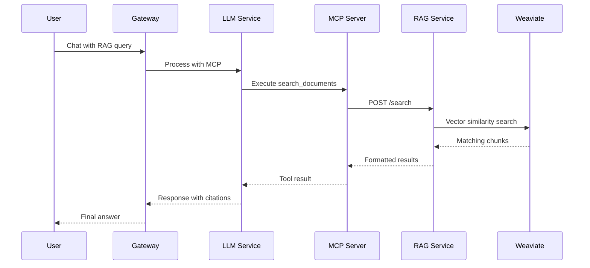

# RAG MCP Integration Plan - Phase 3

## Overview
Complete the integration between the RAG system and MCP by implementing the missing `/rag/search` endpoint that the existing MCP tool expects.

## Current State
- ✅ MCP server already has `search_documents` tool implemented
- ❌ RAG service is missing the `/rag/search` endpoint that MCP expects
- ✅ MCP tool properly formatted with query, limit, and include_sources parameters
- ❌ Need to create the search endpoint to return raw chunks instead of chat answers

## Current State Analysis

### What We Have
1. **RAG Service** (Port 8002)
   - Collections API: Create/manage hierarchical document collections
   - Document Processing: Async ingestion with Celery
   - Vector Store: Weaviate with embeddings
   - Search API: `/chat` endpoint for semantic search

2. **MCP Service** (Port 8004)
   - Local STDIO-based MCP server
   - Existing tools: read_file, list_directory, create_file, etc.
   - Tool execution framework with result tracking

3. **Gateway Integration**
   - `/api/chat/mcp` endpoint that routes to LLM service
   - LLM service connects to MCP for tool execution
   - Tool calls tracked in database

## Implementation Plan

### 1. Existing MCP Tool Analysis

The MCP server already has the `search_documents` tool at line 45 of `main.py`:

```python
@mcp.tool()
async def search_documents(
    query: str,
    limit: int = 10,
    include_sources: bool = True
) -> str:
```

This tool expects to call:
- **Endpoint**: `POST /rag/search`
- **Payload**: `{"query": str, "limit": int, "include_metadata": bool}`
- **Expected Response**: `{"chunks": [...], "search_time_ms": int}`

### 2. Tool Implementation Details

**Key Requirements**:
- Tool must call RAG service internally (http://rag-service:8000)
- Return chunks with metadata (document title, collection, relevance score)
- Format results for LLM consumption
- Handle errors gracefully

**Response Format**:
```json
{
    "results": [
        {
            "content": "Chunk text content...",
            "document_title": "NVIDIA Annual Report 2024",
            "collection": "Financial Reports",
            "relevance_score": 0.92,
            "metadata": {
                "page": 15,
                "section": "Revenue"
            }
        }
    ],
    "total_results": 5,
    "search_time_ms": 145
}
```

### 3. Integration Points

#### A. MCP Server Registration
- Add tool to `src/privategpt/services/mcp/server.py`
- Register in tool registry
- Ensure proper error handling

#### B. Internal Service Communication
- MCP service needs to call RAG service
- Use internal Docker network: `http://rag-service:8000`
- No authentication needed (internal network)

#### C. Search Endpoint Enhancement
- Current: `/rag/chat` expects a question and returns answer
- Need: New endpoint `/rag/search` that returns raw chunks
- Alternative: Modify existing endpoint to support raw mode

### 4. New RAG Endpoint

**Endpoint**: `POST /rag/search`

```python
@router.post("/search")
async def search_documents(
    query: SearchQuery,
    session: AsyncSession = Depends(get_async_session)
):
    """Raw semantic search returning chunks with metadata."""
    return {
        "chunks": [
            {
                "id": chunk.id,
                "text": chunk.text,
                "document_id": chunk.document_id,
                "document_title": doc.title,
                "collection_name": collection.name,
                "score": score,
                "position": chunk.position
            }
        ],
        "total": len(chunks),
        "query": query.text
    }
```

### 5. Tool Execution Flow



### 6. Implementation Steps

#### Step 1: Create Search Endpoint in RAG Service
- [ ] Add `/search` endpoint to rag_router.py
- [ ] Return raw chunks instead of generated answer
- [ ] Include document and collection metadata
- [ ] Support collection filtering

#### Step 2: Implement MCP Search Tool
- [ ] Create search_documents.py tool
- [ ] Add HTTP client for RAG service calls
- [ ] Format results for LLM consumption
- [ ] Add error handling and retries

#### Step 3: Register Tool in MCP Server
- [ ] Add to tool registry
- [ ] Update server.py imports
- [ ] Test tool execution

#### Step 4: Integration Testing
- [ ] Test tool through MCP protocol
- [ ] Verify end-to-end flow
- [ ] Test error scenarios
- [ ] Performance testing

### 7. Advanced Features (Optional)

#### A. Collection-Aware Search
```python
"collection_filter": {
    "type": "object",
    "properties": {
        "collection_ids": ["uuid1", "uuid2"],
        "include_children": true  # Search sub-collections
    }
}
```

#### B. Hybrid Search
- Combine vector similarity with keyword matching
- Boost results based on recency
- Filter by document metadata

#### C. Search Context
- Return surrounding chunks for context
- Highlight matching sections
- Provide document structure info

### 8. Error Handling

**Scenarios to Handle**:
1. RAG service unavailable
2. No documents in collection
3. Invalid collection IDs
4. Embedding service errors
5. Timeout on large searches

**Error Response Format**:
```json
{
    "error": "search_failed",
    "message": "Unable to search documents",
    "details": {
        "reason": "rag_service_unavailable",
        "retry_after": 5
    }
}
```

### 9. Testing Plan

#### Unit Tests
- Mock RAG service responses
- Test tool schema validation
- Test error handling

#### Integration Tests
- Real RAG service calls
- End-to-end MCP flow
- Performance benchmarks

#### Test Scenarios
1. Basic search with results
2. Search with no matches
3. Collection-filtered search
4. Large result sets
5. Service failures

### 10. Configuration

**Environment Variables**:
```bash
# MCP service
RAG_SERVICE_URL=http://rag-service:8000
RAG_SEARCH_TIMEOUT=30
RAG_MAX_RESULTS=20

# Feature flags
ENABLE_COLLECTION_FILTER=true
ENABLE_HYBRID_SEARCH=false
```

## Success Criteria

1. **Functionality**
   - LLM can search documents via tool calls
   - Results include relevant metadata
   - Collection filtering works correctly

2. **Performance**
   - Search completes within 2 seconds
   - Handles 20 concurrent searches
   - Efficient chunk retrieval

3. **Reliability**
   - Graceful error handling
   - Service resilience
   - Consistent results

4. **User Experience**
   - Clear, informative responses
   - Relevant search results
   - Proper citations in answers

## Next Steps

1. Review and approve this plan
2. Implement RAG search endpoint
3. Create MCP search tool
4. Integration testing
5. Documentation updates

## Questions to Resolve

1. Should we modify existing `/chat` endpoint or create new `/search`?
2. What metadata should be included in search results?
3. How many chunks should we return by default?
4. Should we support regex or advanced query syntax?
5. How to handle very large documents?