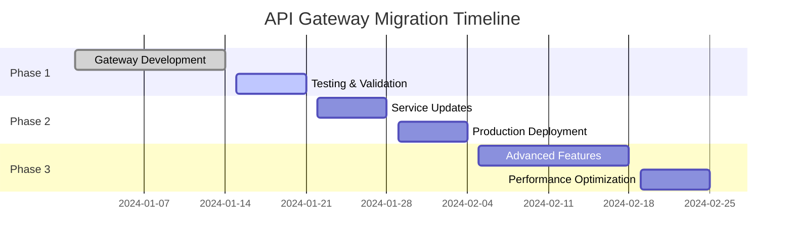

# 🚀 API Gateway Implementation Plan for PrivateGPT Legal AI

## **Executive Summary**

This document outlines the implementation of a centralized API Gateway for the PrivateGPT Legal AI system. The gateway will replace direct service communication with a unified entry point that provides authentication, authorization, rate limiting, observability, and security.

## **🏗️ Current Architecture Problems**

### **1. Direct Service Communication Issues**
- Streamlit app directly calls both auth-service and knowledge-service
- Knowledge service makes HTTP calls back to auth-service for verification
- Duplicated authentication logic across services
- No centralized rate limiting or security policies

### **2. Security Vulnerabilities**
- CORS set to `*` in knowledge service
- Inconsistent JWT validation (placeholder code in `dependencies.py`)
- No unified request/response security headers
- Direct service exposure increases attack surface

### **3. Observability Gaps**
- No centralized request tracing
- Limited metrics collection
- Scattered logging across services
- No unified monitoring dashboard for API usage

### **4. Operational Complexity**
- Multiple service endpoints to manage
- Inconsistent error handling
- No centralized configuration for cross-cutting concerns

## **🎯 API Gateway Solution**

### **Architecture Overview**
```
┌─────────────────────────────────────────────────────────────┐
│                    Client Applications                       │
│  ┌──────────────┐  ┌──────────────┐  ┌──────────────┐      │
│  │  Streamlit   │  │ External API │  │  Mobile App  │      │
│  │     UI       │  │   Clients    │  │   (Future)   │      │
│  └──────────────┘  └──────────────┘  └──────────────┘      │
└─────────────────────────────────────────────────────────────┘
                              │
                              ▼
┌─────────────────────────────────────────────────────────────┐
│                     API Gateway                             │
│  ┌─────────────────────────────────────────────────────┐   │
│  │  Authentication │ Rate Limiting │ Request Logging  │   │
│  │  Authorization  │ Circuit Break │ Metrics          │   │
│  │  CORS Policy   │ Retry Logic   │ Error Handling   │   │
│  └─────────────────────────────────────────────────────┘   │
└─────────────────────────────────────────────────────────────┘
                              │
                              ▼
┌─────────────────────────────────────────────────────────────┐
│                   Backend Services                          │
│  ┌──────────────┐  ┌──────────────┐  ┌──────────────┐      │
│  │ Auth Service │  │ Knowledge    │  │   Future     │      │
│  │              │  │ Service      │  │  Services    │      │
│  └──────────────┘  └──────────────┘  └──────────────┘      │
└─────────────────────────────────────────────────────────────┘
```

### **Gateway Components Implemented**

#### **1. Core Application (`main.py`)**
- FastAPI-based gateway with async/await support
- Health check endpoint with downstream service monitoring
- Prometheus metrics endpoint
- Structured routing with rate limiting

#### **2. Authentication Service (`services/auth_service.py`)**
- Centralized JWT validation
- User context creation
- Client access verification
- Admin privilege checking

#### **3. Proxy Service (`services/proxy_service.py`)**
- Request forwarding to downstream services
- Header manipulation and security header injection
- Streaming response support
- Error handling and timeout management

#### **4. Middleware Stack**
- **Authentication Middleware**: JWT validation and context setup
- **Logging Middleware**: Structured logging with correlation IDs
- **Metrics Middleware**: Prometheus metrics collection
- **Rate Limiting**: Per-endpoint rate limiting with Redis backend

#### **5. Configuration Management (`config.py`)**
- Environment-based configuration with Pydantic
- Service URL configuration
- Security settings and CORS policies
- Rate limiting and timeout configurations

## **📋 Implementation Status**

### **✅ Completed**
1. **Core Gateway Structure**
   - FastAPI application with middleware stack
   - Configuration management system
   - Docker containerization

2. **Authentication & Authorization**
   - JWT validation service
   - User context management
   - Role-based access control
   - Client matter authorization

3. **Request Handling**
   - Proxy service for request forwarding
   - Header management and security headers
   - Error handling and timeout management

4. **Observability**
   - Structured logging with correlation IDs
   - Prometheus metrics collection
   - Request tracing and performance monitoring

5. **Rate Limiting**
   - Redis-backed rate limiting
   - Per-endpoint and per-user limits
   - Configurable rate limit policies

### **🔄 Next Steps Required**

#### **Phase 1: Basic Implementation (1-2 weeks)**
1. **Testing & Validation**
   - Unit tests for all gateway components
   - Integration tests with downstream services
   - Load testing for performance validation

2. **Service Updates**
   - Remove direct service-to-service communication
   - Update Streamlit to use gateway endpoints
   - Remove CORS `*` from individual services

3. **Configuration Updates**
   - Update environment variables
   - Service discovery configuration
   - Security policy enforcement

#### **Phase 2: Advanced Features (2-3 weeks)**
1. **Circuit Breaker Pattern**
   - Implement circuit breakers for downstream services
   - Fallback mechanisms for service failures
   - Health check-based routing

2. **Caching Layer**
   - Redis-based response caching
   - Cache invalidation strategies
   - Performance optimization

3. **Enhanced Security**
   - API key management for service-to-service calls
   - Request/response sanitization
   - Advanced threat detection

## **🔧 Migration Strategy**

### **1. Phased Rollout**


### **2. Backward Compatibility**
- Maintain existing service endpoints during transition
- Gradual migration of client applications
- Feature flags for gateway routing

### **3. Rollback Strategy**
- Blue-green deployment for gateway
- Database migration rollback procedures
- Service endpoint fallback mechanisms

## **📊 Expected Benefits**

### **Security Improvements**
- **Centralized Authentication**: Single point for JWT validation
- **Consistent Security Headers**: OWASP security headers on all responses
- **Rate Limiting**: Protection against abuse and DoS attacks
- **Request Sanitization**: Input validation and output encoding

### **Operational Benefits**
- **Unified Logging**: Structured logs with correlation IDs
- **Centralized Monitoring**: Single dashboard for all API metrics
- **Simplified Deployment**: Single configuration point for cross-cutting concerns
- **Better Error Handling**: Consistent error responses across all APIs

### **Performance Benefits**
- **Response Caching**: Redis-based caching for frequent requests
- **Connection Pooling**: Optimized HTTP connections to downstream services
- **Circuit Breakers**: Fail-fast behavior for unhealthy services
- **Load Balancing**: Future support for multiple service instances

### **Developer Experience**
- **API Documentation**: Unified OpenAPI documentation
- **Consistent APIs**: Standardized request/response formats
- **Better Testing**: Centralized testing infrastructure
- **Easier Integration**: Single API surface for external clients

## **🚀 Deployment Instructions**

### **1. Environment Setup**
```bash
# Add API Gateway environment variables to .env
echo "API_GATEWAY_ENABLED=true" >> .env
echo "GATEWAY_LOG_LEVEL=INFO" >> .env
```

### **2. Build and Deploy**
```bash
# Build the new API Gateway service
docker-compose build api-gateway

# Deploy with the gateway
docker-compose up -d api-gateway

# Verify gateway health
curl http://localhost:8080/health
```

### **3. Update Client Configuration**
```bash
# Update Streamlit to use gateway endpoints
export KNOWLEDGE_SERVICE_URL="http://api-gateway:8000/api"
export AUTH_SERVICE_URL="http://api-gateway:8000/auth"
```

### **4. Monitoring Setup**
```bash
# Access gateway metrics
curl http://localhost:8080/metrics

# View structured logs
docker-compose logs -f api-gateway
```

## **🔍 Testing Strategy**

### **Unit Tests**
- Authentication service validation
- Proxy service request handling
- Middleware functionality
- Configuration management

### **Integration Tests**
- End-to-end request flows
- Service communication validation
- Error handling scenarios
- Performance benchmarking

### **Security Tests**
- JWT validation edge cases
- Rate limiting effectiveness
- CORS policy enforcement
- Security header validation

## **📈 Success Metrics**

### **Technical Metrics**
- **Response Time**: < 100ms overhead for gateway processing
- **Throughput**: Handle 1000+ requests/minute
- **Availability**: 99.9% uptime for gateway service
- **Error Rate**: < 0.1% gateway-specific errors

### **Security Metrics**
- **Authentication Success Rate**: > 99.9%
- **Rate Limit Effectiveness**: Block 100% of exceeded requests
- **Security Header Coverage**: 100% of responses
- **Vulnerability Reduction**: Eliminate direct service exposure

### **Operational Metrics**
- **Log Completeness**: 100% request tracing
- **Monitoring Coverage**: All endpoints monitored
- **Alert Response Time**: < 5 minutes for critical issues
- **Deployment Time**: < 10 minutes for gateway updates

## **🛡️ Security Considerations**

### **JWT Security**
- Secure secret key management
- Token expiration validation
- Signature verification
- Claim validation

### **Rate Limiting**
- Per-user and per-endpoint limits
- Sliding window implementation
- Whitelist for trusted clients
- Graceful degradation

### **Request Validation**
- Input sanitization
- Content-type validation
- Size limits enforcement
- Malicious pattern detection

### **Response Security**
- Security header injection
- Sensitive data redaction
- Error message sanitization
- Information disclosure prevention

This implementation provides a robust, scalable, and secure API Gateway solution that addresses the current architectural challenges while preparing the system for future growth and requirements. 