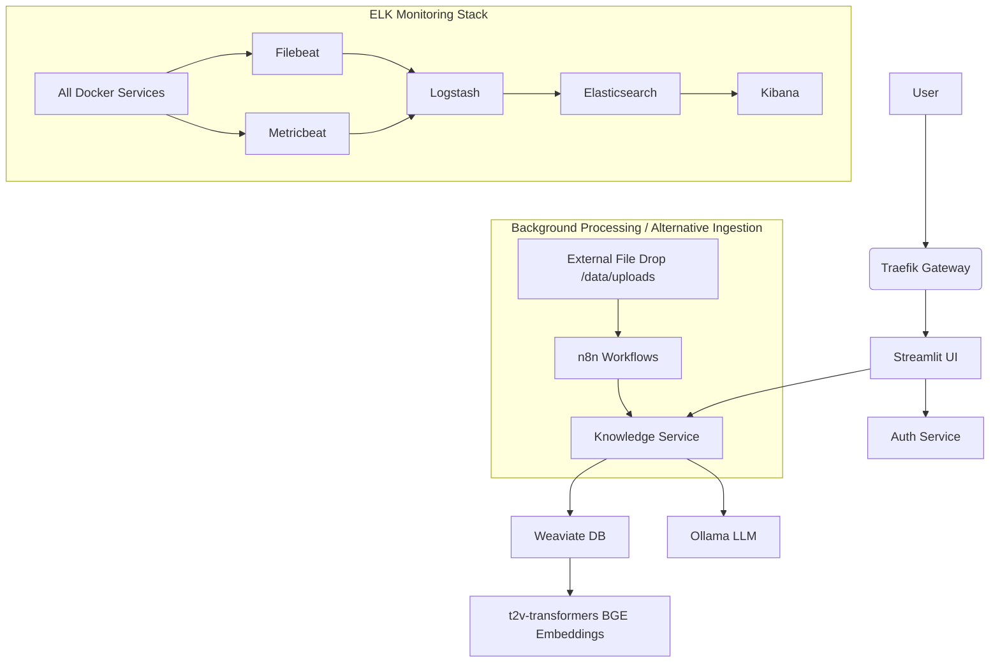

# PrivateGPT Legal AI - Project Structure

This document outlines the complete file structure for the PrivateGPT Legal AI system.

## 📁 Complete Directory Structure

```
privategpt/
├── 📄 README.md                           # Main documentation
├── 📄 PROJECT_STRUCTURE.md               # This file
├── 📄 docker-compose.yml                 # Main orchestration file
├── 📄 env.example                        # Environment template for core services
├── 📄 config.env.example                 # Environment template for UI/auth (potentially different)
├── 🔧 setup.sh                          # Automated setup script
├── 📄 Makefile                          # Management commands (optional)
├── 📄 requirements.txt                   # Python dependencies for some host scripts (e.g., download_test_datasets.py)
├── 📄 download_test_datasets.py          # Script to download test datasets
├── 📄 client_example.py                  # Example client for interacting with services
├── 📄 .gitignore                         # Specifies intentionally untracked files for Git
├── 📄 KNOWLEDGE_SERVICE_COMPLETION.md    # Knowledge service implementation status
├── 📄 README_weaviate_service.md         # Weaviate service documentation
├── 📄 start_service.sh                   # Service startup script
│
├── 🐳 docker/                           # Container definitions
│   ├── auth-service/                    # JWT Authentication service
│   │   ├── Dockerfile
│   │   ├── requirements.txt
│   │   ├── auth_service.py              # Main auth service logic
│   │   └── utils.py                     # Audit logging and security utilities
│   │
│   ├── streamlit/                       # Web UI application
│   │   ├── Dockerfile
│   │   ├── requirements.txt
│   │   ├── app.py                       # Main Streamlit app (login page)
│   │   ├── pages_utils.py               # Shared utilities for Streamlit pages
│   │   ├── .streamlit/                  # Streamlit configuration (e.g., config.toml)
│   │   ├── pages/                       # Streamlit multi-page app pages
│   │   │   ├── dashboard.py
│   │   │   ├── document_management.py
│   │   │   ├── rag_chat.py
│   │   │   ├── llm_chat.py
│   │   │   ├── admin_panel.py
│   │   │   └── __init__.py
│   │   └── utils/                       # UI utilities
│   │       ├── auth_client.py           # Client for auth-service
│   │       ├── rag_engine.py            # RAG logic with Weaviate and Ollama
│   │       ├── document_processor.py    # Text extraction from documents
│   │       └── logger.py                # UI-specific logging
│   │
│   ├── knowledge-service/               # Document processing microservice
│   │   ├── Dockerfile
│   │   ├── requirements.txt
│   │   ├── README.md
│   │   └── app/                         # FastAPI application
│   │       ├── __init__.py
│   │       ├── main.py                  # FastAPI entry point
│   │       ├── models/                  # Pydantic data models
│   │       │   ├── __init__.py
│   │       │   └── schemas.py           # API schemas
│   │       ├── routers/                 # API endpoint definitions
│   │       │   ├── __init__.py
│   │       │   ├── documents.py         # Document CRUD operations
│   │       │   ├── search.py            # Search endpoints
│   │       │   └── chat.py              # RAG chat endpoints
│   │       └── services/                # Business logic layer
│   │           ├── __init__.py
│   │           ├── weaviate_client.py   # Vector DB operations
│   │           ├── embedding.py         # Embedding generation
│   │           └── chunking.py          # Document chunking
│   │
│   └── n8n/                            # Workflow automation (manual workflow import)
│       └── Dockerfile                   # (Workflows are manually imported, not in codebase)
│
├── ⚙️ config/                           # Service configurations
│   ├── traefik/                        # Reverse proxy config
│   │   └── traefik.yml                  # Static Traefik configuration
│   │
│   ├── elasticsearch/                  # Search & analytics engine
│   │   └── elasticsearch.yml           # Elasticsearch configuration
│   │
│   ├── logstash/                       # Log processing pipeline
│   │   ├── logstash.conf               # Main logstash pipeline
│   │   └── logstash.yml                # Logstash service configuration
│   │
│   ├── kibana/                         # Log visualization & dashboards
│   │   └── kibana.yml                  # Kibana configuration
│   │
│   ├── filebeat/                       # Log collection agent
│   │   └── filebeat.yml                # Filebeat configuration
│   │
│   ├── metricbeat/                     # System metrics collection
│   │   └── metricbeat.yml              # Metricbeat configuration
│   │
│   └── n8n/                           # n8n workflow configurations
│       └── workflows/                  # n8n workflow definitions
│
├── 📊 data/                            # Application data (persistent volumes typically map here or similar)
│   ├── uploads/                        # Document upload staging (used by Streamlit and n8n)
│   └── backups/                        # Placeholder for automated backups
│
├── 📋 logs/                            # Host-mapped log directories for services
│   ├── auth/                           # Logs from auth-service
│   ├── app/                            # Logs from streamlit-app
│   ├── ollama/                         # Logs from ollama service
│   ├── weaviate/                       # Logs from weaviate service
│   ├── n8n/                            # Logs from n8n service
│   ├── knowledge-service/              # Logs from knowledge service
│   └── grafana/                        # Legacy logs directory
│
├── 📚 docs/                            # Documentation (placeholder, not explored)
│   ├── api/
│   ├── compliance/
│   ├── deployment/
│   └── user-manual/
│
├── 🧪 scripts/                         # Utility scripts
│   ├── init-ollama.sh                 # Initializes Ollama models
│   ├── setup-n8n-workflows.sh         # Prepares for manual n8n workflow import
│   └── setup-dashboard.sh             # Sets up ELK monitoring dashboards
│
├── 🗄️ knowledge-service-data/          # Knowledge service persistent data
└── 📁 test-documents/                  # Test documents for system validation
```

## 📋 Key Components

### 🐳 Docker Services

| Service            | Description                               | Exposed Port | Internal Port | Purpose                                  |
|--------------------|-------------------------------------------|--------------|---------------|------------------------------------------|
| **traefik**        | Reverse proxy & load balancer             | 8080, 443    | 8080, 443     | Unified access point, Dashboard          |
| **auth-service**   | JWT authentication                        | (via Traefik)| 8000          | User management & security               |
| **streamlit-app**  | Web UI application                        | (via Traefik)| 8501          | Main user interface                      |
| **knowledge-service**| Document processing microservice         | (via Traefik)| 8000          | Document upload, RAG, search             |
| **ollama-service** | LLM serving (LLaMA-3)                     | (via Traefik)| 11434         | AI inference engine                      |
| **weaviate-db**    | Vector database                           | 8081         | 8080          | Document search & RAG                    |
| **t2v-transformers**| BGE embeddings for Weaviate             | (internal)   | 8080          | Text embedding generation                |
| **n8n-automation** | Document processing & workflow automation | (via Traefik)| 5678          | Workflow automation (manual import)      |
| **elasticsearch**  | Search & analytics engine                 | 9200         | 9200          | Log storage and search                   |
| **logstash**       | Log processing pipeline                   | 5044         | 5044          | Log parsing and routing                  |
| **kibana**         | Log visualization & dashboards            | (via Traefik)| 5601          | Monitoring dashboards and log analysis   |
| **filebeat**       | Log collection agent                      | (internal)   | (internal)    | Container log collection                 |
| **metricbeat**     | System metrics collection                 | (internal)   | (internal)    | System and container metrics             |

### 🔐 Security Features

- **JWT Authentication:** Secure token-based auth with 8-hour expiration
- **Role-based Access:** Admin, Partner, Associate, Paralegal roles
- **Client Matter Segregation:** Data isolation by legal matter
- **Audit Logging:** 7-year retention with immutable logs
- **PII Redaction:** Automatic removal of sensitive data from logs
- **Encryption:** LUKS disk encryption for all persistent data

### 📊 Monitoring & Compliance (ELK Stack)

- **Elasticsearch:** Centralized log storage and full-text search
- **Logstash:** Log parsing, transformation, and routing
- **Kibana:** Interactive dashboards and log visualization
- **Filebeat:** Automatic container log collection
- **Metricbeat:** System performance and resource monitoring
- **Custom Dashboards:** Legal compliance metrics and system health

### 🔄 Data Flow



## 🚀 Deployment Process

1. **Environment Setup:** Configure `.env` with secure credentials
2. **Service Deployment:** Run `docker-compose up -d` to start all services
3. **Model Download:** Ollama pulls LLaMA-3 model (8B for dev, 70B for prod)
4. **Schema Initialization:** Weaviate creates document schema
5. **ELK Stack Setup:** Automatic index patterns and dashboard creation
6. **User Creation:** Default admin user created automatically
7. **Health Verification:** All services checked for proper startup

## 📈 Scaling Considerations

### Single-Instance (Current)
- **Target:** 1-50 users
- **Hardware:** RTX 4090 or A100 80GB
- **Cost:** $300-1200/month

### Multi-Instance (Future)
- **Target:** 50+ users
- **Architecture:** Kubernetes deployment
- **Features:** Load balancing, auto-scaling, HA

## 🔧 Configuration Files

### Environment Variables (`.env`)
- Security credentials (JWT secrets, API keys)
- Model configuration (LLaMA variants)
- Resource limits and timeouts
- Legal compliance settings

### Docker Compose (`docker-compose.yml`)
- Service definitions and dependencies
- Network configuration
- Volume mounts and persistence
- Health checks and restart policies

### ELK Stack Configuration
- **Elasticsearch:** Data storage and indexing
- **Logstash:** Log processing pipelines
- **Kibana:** Dashboard definitions and data views
- **Beats:** Log and metric collection configuration

## 🛡️ Security Architecture

### Authentication Flow
1. User login via Streamlit UI
2. Credentials validated by auth service
3. JWT token issued with user roles
4. Token verified for each request
5. Role-based authorization enforced

### Data Protection
- **At Rest:** LUKS full-disk encryption
- **In Transit:** TLS 1.3 for all communications
- **Processing:** Client matter segregation
- **Logging:** PII redaction and structured compliance logs

## 📚 Documentation Structure

- **README.md:** Quick start and overview
- **API Documentation:** Service endpoints and schemas
- **Compliance Guide:** Legal industry requirements
- **User Manual:** End-user instructions
- **Deployment Guide:** Production setup procedures

---

This structure provides a complete, production-ready legal AI system with comprehensive compliance monitoring and professional-grade security controls using the ELK stack for observability. 