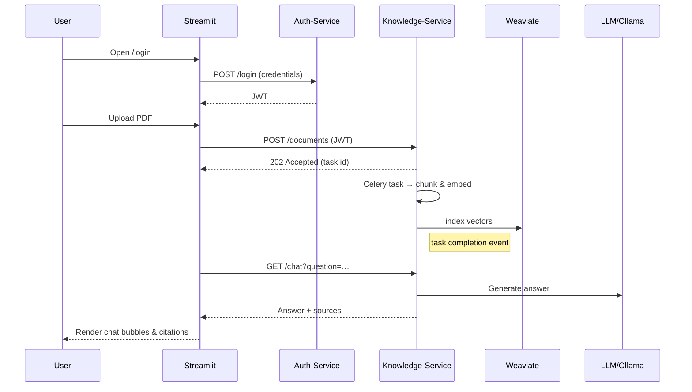

# PrivateGPT – Legacy (v1) Codebase Documentation

> **Primary Location:** `docker/`     *multi-container production stack*  
> **Secondary (experimental):** `src/privategpt/`     *an unfinished refactor that was abandoned once the full **v2** effort began.*

---

## 1  High-Level Architecture

Version 1 of PrivateGPT is organised as a set of **independently containerised micro-services** that communicate over HTTP, WebSockets and Celery queues.  Each micro-service is a self-contained Python application with its own `requirements.txt`, `Dockerfile`, and (sometimes) local tests.

```
┌───────────────────────────────────┐          ┌────────────────────────────┐
│  Streamlit UI  (rag_chat, etc.)   │ ◀─REST──▶│ Knowledge-Service  (FastAPI│
└───────────────────────────────────┘          └────────────────────────────┘
         ▲           ▲                                      ▲
         │ WebSocket │                                      │ Celery
         │           │                                      ▼
┌───────────────────────────────────┐          ┌────────────────────────────┐
│     Auth-Service  (FastAPI)       │ ◀────────┤  Worker Processes / Tasks  │
└───────────────────────────────────┘          └────────────────────────────┘
```

A lightweight **shared** package (`docker/shared`) provides common helpers (DB base classes, logging).  An *n8n* folder contains the config needed to run a low-code automation service but is entirely optional.

---

## 2  Directory Map (`docker/`)

```text
docker/
├─ auth-service/           ← User & token management (FastAPI + JWT)
│   ├─ auth_service.py       Main ASGI app
│   ├─ models.py             Pydantic & SQLAlchemy models
│   ├─ security.py           Hashing/JWT helpers
│   ├─ migrate_data.py       One-off migration script
│   └─ …
│
├─ knowledge-service/       ← RAG back-end (FastAPI + Celery)
│   ├─ app/                 ← routers/, services/, tasks/
│   ├─ celery_app.py         Celery configuration
│   ├─ requirements.txt
│   └─ …
│
├─ streamlit/               ← *NOT* deprecated – customer-facing UI
│   ├─ app.py                Streamlit entry-point
│   ├─ pages/                llm_chat.py, rag_chat.py, …
│   ├─ utils/                document_processor.py, embedding utilities, etc.
│   └─ requirements.txt
│
├─ shared/                  ← Utilities reusable across services
│   ├─ database/             SQLAlchemy base + Alembic helpers
│   └─ utils/                Structured logging
│
└─ n8n/                     ← (Optional) UI workflow automation service
```

---

## 3  Micro-Service Details

### 3.1 Auth-Service (`docker/auth-service`)
* **Framework:** FastAPI  
* **Endpoints:** `/register`, `/login`, `/refresh`, `/users/{id}` …  
* **Persistence:** PostgreSQL (provisioned via `docker-compose.auth.yml`), Alembic migration tracked in `init-db.sql`.
* **Security:** JWT tokens issued and verified by `security.py` (SHA-256 hashing, 15-min expiry + refresh token).

### 3.2 Knowledge-Service (`docker/knowledge-service/app`)
* **Responsibilities:**
  * Accept document uploads → chunk + embed → index in Weaviate.
  * Serve `/rag/chat` endpoint (LLM answer with citations).
  * Spawn Celery **tasks** (`tasks/document_tasks.py`) for heavy work (embedding, splitting).
* **External deps:** Weaviate, Ollama or OpenAI, Redis (broker + result backend).

### 3.3 Streamlit UI (`docker/streamlit`)
* Presents dashboards for **Admin**, **Document Management**, and the **RAG Chat** interface.
* Talks to Auth-Service for login & token refresh, and to Knowledge-Service for chat/ingestion via REST + websockets.
* Live reload enabled in `Dockerfile`; config stored under `.streamlit/`.

### 3.4 Shared Utilities (`docker/shared`)
* **Logging:** `shared/utils/logging.py` adds JSON, colourised & file handlers.
* **Database Base:** `shared/database/base.py` centralises SQLAlchemy model base & engine creation.

### 3.5 n8n (`docker/n8n`)
Optional low-code workflow engine; no first-party Python code, but compose and env templates provided to orchestrate external integrations (Slack, email, etc.).

---

## 4  Data Flow (Happy Path)



---

## 5  Development Runbook (v1)

```bash
# 1. Spin up ALL containers (Postgres, Redis, Weaviate, services, UI)
docker compose -f docker-compose.yml up --build

# 2. Open the UI
open http://localhost:8501  # Streamlit

# 3. Optional: run unit tests for a given service
docker compose run --rm auth-service pytest -q
```

> **Tip:** Each service has its own dedicated `docker-compose.<service>.yml` for focused debugging.

---

## 6  Status of `src/privategpt/`


---

## 7  Known Pain-Points & Migration Targets

1. **Tight coupling** between Streamlit and service URLs – migrate to an API-gateway in v2.
2. **Sync SQLAlchemy** usage inside Auth-Service blocks the event loop – already solved in v2 with async.
3. **Celery broker** configured per-environment; replace with Redis Streams or NATS JetStream.
4. **Embedding model diversity** – current service hard-codes OpenAI; v2 adds pluggable embedders.

---

## 8  Changelog Pointer
The last production commit in the docker stack is `⟨v1-prod-sha⟩`.  Only hot-fixes should be applied while the migration proceeds. 