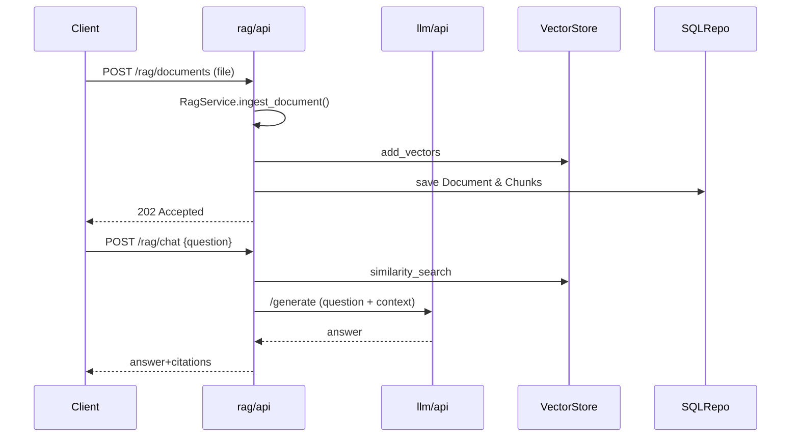

# PrivateGPT – v2 Architecture Guide

> Location of code: `v2/src/privategpt/`

This document is the **canonical reference** for the *vertical-slice* v2 PrivateGPT codebase.  Every micro-service now owns its own domain core, adapters and HTTP layer so teams can evolve and deploy them independently.

---
## 1  Goals
1. **Pure Domain Core** – business logic lives in `core/` inside *each service* – no external I/O.
2. **Replaceable Adapters** – every external concern (DB, vector-store, embedder, LLM, queue, logger, …) is accessed through a small `Port` interface.
3. **Full Async IO** – high throughput workers & HTTP endpoints.
4. **Observability First** – structured JSON logs aggregated in Kibana.

---
## 2  Repository Layout (2025-06-rev)
```text
v2/src/privategpt/
├─ shared/                 ← Cross-cutting helpers (settings, logging, security)
│
├─ services/
│   ├─ auth/               ← Authentication micro-service
│   │   ├─ core/           ← User aggregate + AuthService + ports
│   │   ├─ adapters/       ← SQLAlchemy repo, bcrypt hasher, etc.
│   │   └─ api/            ← FastAPI routes
│   │
│   ├─ llm/                ← Centralised model inference
│   │   ├─ core/           ← LLMPort protocol
│   │   ├─ adapters/       ← EchoAdapter, OllamaAdapter, OpenAIAdapter (pluggable)
│   │   └─ api/            ← /generate endpoint
│   │
│   └─ rag/                ← Retrieval-Augmented Generation
│       ├─ core/           ← RagService orchestration
│       ├─ adapters/       ← Splitter, Embedder, VectorStore, Repositories
│       └─ api/            ← /rag/* document & chat endpoints
│
└─ tests/                  ← Unit & integration tests
```

Each service builds its own Docker image (`v2/docker/<service>/Dockerfile`).  A thin `base` image holds common dependencies.

---
## 3  Core Domain & Ports
The pure Python contracts are still shared under `privategpt.core.*` for now to avoid duplication; services import only what they need.  Over time, stable pieces can be copied locally if stronger isolation is required.

---
## 4  Happy-Path Data-Flow (RAG)


---
## 5  Logging & Observability
### 5.1 Log pipeline (container-native)
1. **Emit** – any code that needs a logger calls:
   ```python
   from privategpt.shared.logging import get_logger
   log = get_logger("vector.memory")
   log.info("vector.search", top_k=3, store_size=len(self._store))
   ```
   `shared.logging` injects `service_name` (from `$SERVICE_NAME`) and
   `request_id` (from FastAPI middleware) into every JSON record.

2. **Collect** – a Filebeat side-car runs with docker-autodiscover; its
   input config is:
   ```yaml
   filebeat.autodiscover:
     providers:
       - type: docker
         templates:
           - condition.equals:
               docker.container.labels.logging.service: "*"
             config:
               - type: container
                 paths:
                   - /var/lib/docker/containers/${data.docker.container.id}/*.log
                 json.keys_under_root: true
   ```
   Only containers that carry the label
   `logging.service=<service>` are harvested.

3. **Enrich & ship** – Filebeat adds docker metadata, renames `service`
   → `service_name`, then ships to Elasticsearch with index pattern:
   `privategpt-${service_name}-%{+yyyy.MM.dd}`.

4. **Store** – Elasticsearch keeps 14 days of logs by ILM policy (see
   `config/elasticsearch/logs-policy.json`).

5. **Visualise** – Kibana objects live in
   `docs/observability/kibana_dashboard.ndjson` and are imported
   automatically by `make stack-logs`.

### 5.2 Developer workflow
```bash
# 1. spin up log stack + auto-import dashboard
make stack-logs

# 2. run services (eg. rag) in another terminal / compose project

# 3. open http://localhost:5601 → Dashboard → "PrivateGPT – Service Logs"
```

### 5.3 Checklist for new adapters
- [ ] Call `get_logger()` with a meaningful component name
- [ ] Log at least one `info` per public method with an `event` field
- [ ] Wrap exceptions with `logger.exception(event="exception")`

---
## 6  Road-map Snippets
1. Harden Celery queue & monitoring for ingestion pipeline.
2. Swap EchoAdapter with production LLM back-end (vLLM).
3. Integration tests in CI: PostgreSQL + Weaviate + Redis + all services.
4. Autoscaling policies per service (k8s HPA).

---
*Updated: 2025-06-17*
